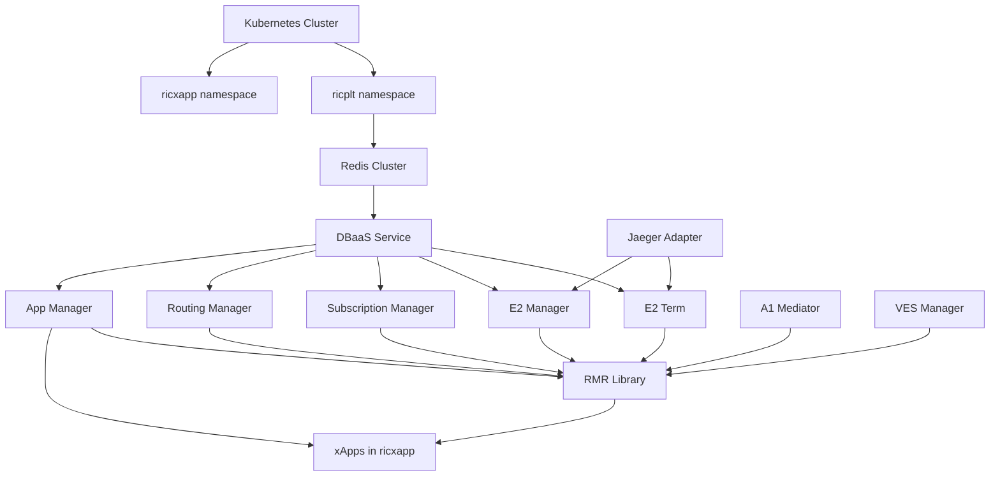

# CLAUDE.md

## AI Patch Guardrails (for Claude Code)

You are Claude Code working on this repository.  
Your main responsibilities are:
- Help implement small, well-scoped changes.
- Respect existing architecture, tests, and maintainer feedback.
- Avoid over-engineering and premature abstraction.

**IMPORTANT: You MUST follow all rules in this section whenever you propose patches or edit files.**

---

### 0. General workflow

1. **Explore & understand before coding**
   - ALWAYS read the relevant files and existing tests first.
   - Summarize your understanding and planned changes before editing.
   - If anything is ambiguous, ask for clarification instead of guessing.

2. **Plan → Implement → Verify**
   - Make a short plan (“think hard”) before you start editing.
   - Keep changes minimal and focused on the requested task.
   - Always run the relevant tests or at least explain precisely how to run them.

3. **Respect project-local rules**
   - The rules below (imports, logging, Dockerfile, tests, etc.) come from real code review feedback.
   - Treat them as authoritative for this repository.

---

### 1. Function abstraction & structure

**IMPORTANT: DO NOT introduce premature abstractions.**

1. **No trivial wrapper functions**
   - If a function only:
     - has 1–2 lines, AND
     - just calls another function (e.g., `return compose_text_message(...)`),
     - and is used only 1–2 times,
   - THEN: DO NOT create a separate helper function for it.
   - Example: DO NOT create `create_error_message(lang_code: str)` that only wraps `compose_text_message(get_response(...))`.

2. **Rule of Three (YAGNI)**
   - 1st occurrence: write the code inline.
   - 2nd occurrence: copy-paste is acceptable.
   - 3rd occurrence: you MAY propose a helper.
   - 4th occurrence: you SHOULD refactor into a shared abstraction.
   - Any refactor MUST clearly improve readability and reduce real duplication, not just “cosmetic” wrapping.

3. **Handler vs implementation**
   - For public handlers, follow this pattern:
     - `handler()`:
       - Handles `try/except`.
       - Logs exceptions with `logger.exception(...)`.
       - Returns a standard error message.
     - `_handler_impl()`:
       - Contains business logic only.
   - DO NOT move complex business logic into the handler.

---

### 2. Python imports

**IMPORTANT: All imports MUST follow PEP 8 and be at module top-level.**

1. **Placement**
   - Place imports at the top of the file, after module comments/docstring.
   - DO NOT add imports inside functions or methods unless explicitly documented as an exception.

2. **Order**
   - Group imports as:
     1. Standard library
     2. Third-party libraries
     3. Local modules
   - Separate each group with a blank line.

3. **Example**

```python
# 1. Standard library
from typing import Dict, Optional

# 2. Third-party
from linebot.v3.messaging import TextMessage

# 3. Local modules
from src.modules.qna.constants import RESPONSE_DATA_PATH
from src.modules.utils import compose_text_message, get_response
```

---

### 3. Logging & error handling

1. **Use `logger.exception` in `except` blocks**
   - When catching unexpected errors in handlers, prefer:
     ```python
     except Exception as e:
         logger.exception(f"Error in qna_handler: {e}")
         return compose_text_message(
             get_response(RESPONSE_DATA_PATH, "error_message", lang_code)
         )
     ```
   - This captures the full stack trace at ERROR level.

2. **Separation of concerns**
   - Handlers:
     - Validate input.
     - Call `_impl`.
     - Catch and log unexpected errors.
   - `_impl` functions:
     - Contain business logic and can be unit-tested directly.

---

### 4. Dockerfile changes

**IMPORTANT: Keep runtime images slim and focused on runtime dependencies.**

1. **Base image**
   - Prefer minimal base images similar to:
     ```Dockerfile
     FROM ghcr.io/astral-sh/uv:python3.13-bookworm-slim
     ```

2. **Dependency installation**
   - Copy only `pyproject.toml` and lockfiles before running the install command.
   - Install ONLY runtime dependencies inside the final image.
   - DO NOT install tools that are only required for:
     - type checking (e.g. pyright),
     - linters,
     - local development.
   - If such tools are needed, suggest:
     - a dev-only image, or
     - a separate `dev` target in the Dockerfile,
     - but DO NOT add them silently.

---

### 5. Code smell & refactoring

When you notice repetition:

1. **Do NOT refactor automatically just because you see repetition.**
   - First, check:
     - Is this “incidental” repetition (similar text but different semantics)?
     - Or “essential” repetition (same logic, same semantics)?

2. **Avoid shotgun surgery**
   - If a change requires modifying many different files and call sites for a small benefit, you are probably introducing a bad abstraction.
   - In that case:
     - Explain the tradeoffs.
     - Ask the user before proceeding with a large refactor.

---

### 6. Tests & TDD

**IMPORTANT: Tests must be meaningful, not just “green”.**

1. **Correct TDD order**
   - DO NOT follow:
     - “write tests → accept whatever output you get”.
   - Instead:
     - Read the existing implementation first.
     - Understand whether the feature is implemented or still TODO.
     - Design tests that match the intended behavior.
     - Then update implementation to satisfy those tests.

2. **Detect unimplemented features**
   - If you see any of the following:
     - `// TODO: implement this`
     - returning an **empty struct** (e.g., `Tracing: &SomeType{}`)
     - variables assigned but only used as `_ = variable`
     - golden files containing empty objects like `tracing: {}`
   - THEN:
     - Treat the feature as “NOT YET IMPLEMENTED”.
     - DO NOT write tests that pretend the feature is fully working.
     - Instead, you may:
       - Add clearly labeled placeholder tests, OR
       - Create a GitHub issue describing the missing implementation.

3. **Test naming**
   - Use precise names:
     - `valid-X` → tests the successful path.
     - `invalid-X` → tests error handling and validation failures.
     - `placeholder-X` → feature not yet fully implemented, placeholder coverage only.
   - DO NOT name a test `invalid-tracing` if it does not actually test invalid behavior.

4. **No skipped tests in new code**
   - DO NOT add tests with `t.Skip()` unless explicitly requested and clearly documented as a temporary measure.
   - All new tests you add SHOULD run and pass on CI.

5. **Avoid redundant tests**
   - Before adding a new test file:
     - Check existing E2E / integration tests.
     - If existing tests already cover the behavior, DO NOT add redundant tests.
   - Example: For minimal RBAC changes, prefer relying on existing E2E tests rather than adding new tests that just verify Kubernetes basics.

6. **Use standard library & project helpers**
   - In Go tests:
     - Prefer `strings.Contains` over custom substring checks.
     - Use existing helper packages (e.g. `ktesting/setup.go`) instead of building ad-hoc loggers or setups.

---

### 7. File selection & change scope

**IMPORTANT: Keep diffs minimal and focused.**

1. **Verify file usage before editing**
   - Before modifying a file:
     - Check if it is still used in the build/runtime.
     - For suspicious files (e.g., old generators like `kubebuilder-gen.go`):
       - Use `git grep` or build commands to confirm usage.
   - If a maintainer comment says “this file is not used anymore, better to delete it”:
     - DO NOT update the file.
     - Suggest deleting it instead, if appropriate for this PR.

2. **Minimal patch principle**
   - For tasks like “minimal RBAC fix”:
     - Focus only on the specific RBAC manifests mentioned by the issue or reviewer.
     - Avoid:
       - editing unrelated manifests,
       - adding new test suites,
       - touching generator files unless required.

3. **Respect project conventions**
   - Follow existing patterns in the codebase:
     - Same logging style.
     - Same error handling style.
     - Same file layout and naming conventions.

---

### 8. Human review & maintainer feedback

1. **Maintainer comments are authoritative**
   - When a reviewer (e.g. project maintainer) gives feedback like:
     - “These tests are unnecessary.”
     - “This file is unused; delete it instead of updating it.”
   - You MUST:
     - Treat this feedback as the source of truth for future edits.
     - Reflect these rules in your subsequent patches.

2. **Document learnings**
   - When you discover a new project-specific rule through review:
     - Propose an update to `CLAUDE.md` (or ask the user to add it).
     - Follow the updated rule consistently in future changes.

---

### 9. How to work with tests & golden files in this repo

1. **Golden files**
   - When adding or updating golden files (YAML, JSON, etc.):
     - Ensure they contain meaningful, non-empty configuration.
     - If the implementation is a placeholder, clearly mark the golden file as such with comments.
     - Question suspicious emptiness (e.g., `tracing: {}`) and check whether the feature is really implemented.

2. **Creating follow-up issues**
   - If you identify missing behavior (e.g., tracing translation not fully implemented):
     - Propose creating a GitHub issue with:
       - Title, e.g.: `"Implement tracing translation in AgentgatewayPolicy frontend"`.
       - Links to the relevant PR / tests / files.
       - A plan for implementation and test updates.

---

### 10. Claude Code behavior summary (TL;DR)

When generating patches in this repo, you MUST:

- **Understand before coding**: read implementation & tests first.
- **Keep changes minimal**: avoid editing unused files or adding redundant tests.
- **Avoid premature abstraction**: no one-line wrappers unless used ≥3 times AND more readable.
- **Follow local style**: imports at top, logging via `logger.exception`, handler + `_impl` split, slim Dockerfiles.
- **Design meaningful tests**: no fake “invalid” tests, no `t.Skip()` tests, no empty golden files unless clearly marked as placeholders.
- **Respect maintainers**: treat review comments as project rules and adjust your behavior accordingly.

If you are unsure which rule applies, you MUST stop, summarize the options, and ask the user for guidance before making large-scale or irreversible changes.


## Context and Problem Statement

當前 O-RAN RIC Platform 採用**輕量化模擬架構**，雖然適合快速開發和學習，但存在以下問題：

1. **不符合 O-RAN 標準**: 使用 HTTP 通訊，而非 E2AP/RMR 協議
2. **無法接入真實設備**: E2 Simulator 無法替代真實 gNodeB
3. **缺少核心組件**: 15+ 個 RIC Platform 組件未部署
4. **生產不可用**: 缺乏高可用性、可擴展性、安全性機制
5. **技術債累積**: xApps 與模擬器緊耦合

**核心問題**: 如何從輕量化架構安全遷移到符合 O-RAN 標準的完整 RIC Platform，同時保持零停機和功能連續性？

---

## Decision Drivers

### Technical Drivers
- ✅ **O-RAN Compliance**: 必須符合 O-RAN SC J-Release 標準
- ✅ **Real E2 Node Support**: 必須能接入真實 gNodeB (未來需求)
- ✅ **Production Readiness**: 高可用性、可擴展性、監控能力
- ✅ **Performance**: RMR throughput > 1000 msg/s, E2E latency < 100ms

### Business Drivers
- ✅ **Zero Downtime**: 遷移期間系統持續可用
- ✅ **Risk Mitigation**: 可快速 rollback
- ✅ **Team Productivity**: 開發團隊能夠理解和維護
- ✅ **Timeline**: 一天內完成遷移

### Engineering Drivers
- ✅ **Maintainability**: 代碼清晰、文檔完善
- ✅ **Testability**: 高測試覆蓋率（> 80%）
- ✅ **Modularity**: 組件獨立部署和測試
- ✅ **Backward Compatibility**: 平滑遷移，避免 Big Bang

---

## Considered Options

### Option 1: Big Bang Migration（一次性遷移）

**描述**: 停止當前系統，部署完整 RIC Platform，重新啟動

**Pros**:
- ✅ 簡單直接，無需平行變更
- ✅ 遷移時程短（2-4 週）
- ✅ 代碼清晰，無過渡邏輯

**Cons**:
- ❌ **長時間停機**（數小時到數天）
- ❌ **高風險** - 無法快速 rollback
- ❌ **測試不充分** - 難以在生產環境逐步驗證
- ❌ **壓力大** - 團隊需要在短時間內解決所有問題

**評估**: ❌ **不適用** - 違反零停機要求

---

### Option 2: Greenfield Deployment（新環境部署）

**描述**: 在新的 K8s cluster 部署完整 RIC Platform，完成後切換流量

**Pros**:
- ✅ 無風險 - 新舊系統隔離
- ✅ 充分測試 - 可在新環境完整驗證
- ✅ 簡單 rollback - 切回舊環境即可

**Cons**:
- ❌ **資源浪費** - 需要雙倍資源（兩套環境）
- ❌ **數據同步複雜** - 需同步 Redis/Prometheus 數據
- ❌ **切換風險** - DNS/Load Balancer 切換可能出錯
- ❌ **成本高** - 雲環境成本翻倍

**評估**: 🟡 **可選** - 適合有充足資源的生產環境，但當前單機環境不適用

---

### Option 3: Parallel Change (Expand-Contract) Migration（平行變更遷移）✅ SELECTED

**描述**: 使用 Expand-Migrate-Contract 模式逐步遷移

**階段 1 - EXPAND (擴展)**:
- 部署新組件（E2Term, DBaaS 等）但不啟用
- xApps 同時支援 HTTP + RMR 接口
- E2 Simulator 雙重發送（HTTP + E2AP）

**階段 2 - MIGRATE (遷移)**:
- 使用 Feature Flag 逐步切換流量
- 金絲雀發布（10% → 50% → 100%）
- 持續監控和調整

**階段 3 - CONTRACT (收縮)**:
- 移除舊接口（HTTP endpoints）
- 清理過渡代碼
- 優化配置

**Pros**:
- ✅ **零停機** - 新舊系統並行運行
- ✅ **低風險** - 可隨時 rollback
- ✅ **漸進式驗證** - 逐步測試和優化
- ✅ **團隊學習** - 有時間理解新架構
- ✅ **符合業界最佳實踐** (Martin Fowler)

**Cons**:
- ⚠️ 複雜度較高 - 需維護雙重接口
- ⚠️ 遷移時程較長（16 週）
- ⚠️ 需要 Feature Flag 管理
- ⚠️ 測試範圍增加（HTTP + RMR）

**評估**: ✅ **最佳選擇** - 平衡風險、時程、複雜度

---

### Option 4: Strangler Fig Pattern（絞殺者模式）

**描述**: 逐個替換組件，新組件"絞殺"舊組件

**Pros**:
- ✅ 漸進式遷移
- ✅ 低風險

**Cons**:
- ❌ **不適合本場景** - 當前架構與目標架構差異太大
- ❌ 難以定義清晰的"絞殺"邊界
- ❌ 組件間依賴複雜（E2Term ↔ E2Mgr ↔ SubMgr）

**評估**: ❌ **不適用** - 更適合微服務重構，而非架構遷移

---

## Decision Outcome

**Chosen option**: **Option 3 - Parallel Change (Expand-Contract) Migration**

**理由**:
1. ✅ 滿足所有 Decision Drivers
2. ✅ 業界成熟模式（Kubernetes Rolling Updates 核心原理）
3. ✅ 適合當前團隊規模和資源限制
4. ✅ 可分解為小 PRs（Small CLs 原則）
5. ✅ 支援 TDD 和 Boy Scout Rule

---

## Consequences

### Positive Consequences

- ✅ **零停機遷移**: 用戶感知不到遷移過程
- ✅ **風險可控**: 每階段都可獨立驗證和 rollback
- ✅ **學習機會**: 團隊深入理解 O-RAN 標準架構
- ✅ **代碼質量提升**: 遵循 Boy Scout Rule，遷移同時改善代碼
- ✅ **測試覆蓋率提升**: TDD 驅動開發
- ✅ **文檔完善**: 每個 PR 都需要文檔更新

### Negative Consequences

- ⚠️ **過渡期複雜度**: 需維護雙重接口（HTTP + RMR）
  - **Mitigation**: 明確標記過渡代碼，設定 deprecation timeline
  - **Example**:
    ```python
    @deprecated("Will be removed in v2.0.0 - Use RMR interface instead")
    def handle_http_indication():
        pass
    ```

- ⚠️ **測試工作量增加**: 需同時測試 HTTP 和 RMR 路徑
  - **Mitigation**: 自動化測試、共用測試邏輯
  - **Example**:
    ```python
    @pytest.mark.parametrize("interface", ["http", "rmr"])
    def test_kpi_processing(interface):
        # Shared test logic
        pass
    ```

- ⚠️ **遷移時程較長**: 需要 16 週完成
  - **Mitigation**: 明確里程碑、每週進度檢查
  - **Tools**: GitHub Projects, Weekly Sprint Review

- ⚠️ **Feature Flag 管理**: 需要管理多個 feature flags
  - **Mitigation**: 集中管理環境變數、自動化配置
  - **Example**:
    ```yaml
    # config/feature-flags.yaml
    kpimon:
      enable_rmr: true
      rmr_traffic_ratio: 0.5
      deprecate_http_date: "2026-01-01"
    ```

### Risks

| Risk | Probability | Impact | Mitigation |
|------|-------------|--------|------------|
| 雙重接口引入 bug | Medium | Medium | 完整單元測試 + 整合測試 |
| Feature flag 配置錯誤 | Low | High | Schema validation + Automated tests |
| 遷移延期 | Medium | Medium | 每週進度檢查 + Buffer time |
| 團隊學習曲線 | Medium | Low | 培訓 + 文檔 + Pair programming |

---

## Implementation

### Phase Breakdown

遷移分為 **6 個階段**，每階段 2-3 週：

1. **Phase 0 (Week 1-2)**: Preparation
   - 環境準備、版本確認、測試框架建立

2. **Phase 1 (Week 3-4)**: Infrastructure Layer
   - 部署 Redis Cluster + DBaaS (SDL)

3. **Phase 2 (Week 5-6)**: E2 Core Components
   - 部署 E2Term + E2Mgr + SubMgr

4. **Phase 3 (Week 7-8)**: RMR + Routing Manager
   - 部署 RTMgr + RMR library

5. **Phase 4 (Week 9-12)**: xApps Migration (平行變更)
   - 逐個 xApp 遷移至 RMR（5 個 xApps）

6. **Phase 5-6 (Week 13-16)**: Additional Components + Validation
   - 部署 AppMgr, A1 Mediator, Jaeger
   - 完整 E2E 測試 + 文檔

### Small PRs Strategy

每個 PR 遵循以下原則：
- ✅ **Single Responsibility**: 每個 PR 只做一件事
- ✅ **< 400 lines**: 限制變更行數
- ✅ **Independent Deploy**: 可獨立部署
- ✅ **Tested**: 包含測試
- ✅ **Documented**: 更新 README

**範例 PR 序列**:
```
PR-01: Add Redis Cluster deployment           (~200 lines)
PR-02: Add DBaaS deployment                   (~250 lines)
PR-03: Add E2 Term deployment                 (~300 lines)
PR-04: Add E2 Manager deployment              (~280 lines)
PR-05: Add Subscription Manager               (~250 lines)
PR-06: Add Routing Manager                    (~350 lines)
PR-07: KPIMON: Add RMR support (parallel)     (~400 lines)
PR-08: KPIMON: Deprecate HTTP endpoint        (~50 lines)
PR-09: E2 Sim: Add E2AP support               (~350 lines)
...
```

### TDD Application

每個組件部署遵循 Red-Green-Refactor 循環：

```bash
# Step 1: RED - 寫測試（預期失敗）
$ cat > tests/test_dbaas.sh <<EOF
#!/bin/bash
kubectl get svc -n ricplt dbaas-tcp || exit 1
curl -f http://dbaas.ricplt.svc.cluster.local:6379/ping || exit 1
EOF

$ bash tests/test_dbaas.sh
# Expected: FAIL (DBaaS not deployed yet)

# Step 2: GREEN - 部署組件
$ helm install r4-dbaas ./ric-dep/helm/dbaas --namespace ricplt

$ bash tests/test_dbaas.sh
# Expected: PASS

# Step 3: REFACTOR - 優化配置
$ helm upgrade r4-dbaas ./ric-dep/helm/dbaas \
    --set resources.requests.memory=512Mi
```

### Boy Scout Rule Application

遷移每個組件時，同步改善：

**Before** (輕量化架構):
```python
# kpimon/src/main.py
from flask import Flask, request

app = Flask(__name__)

@app.route('/e2/indication', methods=['POST'])
def handle():
    data = request.json
    # Process...
    return {'status': 'ok'}
```

**After** (遷移 + Boy Scout Rule):
```python
# kpimon/src/main.py
from flask import Flask, request, jsonify
import logging
import time
from prometheus_client import Counter, Histogram

# Structured logging
logger = logging.getLogger(__name__)
logging.basicConfig(
    level=logging.INFO,
    format='%(asctime)s - %(name)s - %(levelname)s - %(message)s'
)

# Metrics
processing_duration = Histogram(
    'kpimon_processing_duration_seconds',
    'E2 indication processing duration',
    ['interface', 'status']
)
messages_processed = Counter(
    'kpimon_messages_processed_total',
    'Total E2 indications processed',
    ['interface', 'status']
)

app = Flask(__name__)

@app.route('/e2/indication', methods=['POST'])
def handle_e2_indication():
    """
    Handle E2 Indication messages via HTTP.

    NOTE: This endpoint is DEPRECATED and will be removed in v2.0.0.
    Use RMR interface instead.

    Returns:
        JSON response with processing status
    """
    start_time = time.time()

    try:
        data = request.json

        # Input validation
        if not data or 'measurements' not in data:
            logger.warning(
                "Invalid E2 indication format",
                extra={'data': data}
            )
            messages_processed.labels(
                interface='http',
                status='error'
            ).inc()
            return jsonify({'error': 'Invalid data'}), 400

        # Process indication
        result = process_indication(data, interface='http')

        # Metrics
        duration = time.time() - start_time
        processing_duration.labels(
            interface='http',
            status='success'
        ).observe(duration)
        messages_processed.labels(
            interface='http',
            status='success'
        ).inc()

        logger.info(
            "Processed E2 indication",
            extra={
                'cell_id': data.get('cell_id'),
                'ue_id': data.get('ue_id'),
                'duration_ms': duration * 1000
            }
        )

        return jsonify({'status': 'success'}), 200

    except Exception as e:
        logger.exception(
            "Failed to process E2 indication",
            extra={'error': str(e)}
        )
        messages_processed.labels(
            interface='http',
            status='error'
        ).inc()
        return jsonify({'error': 'Internal error'}), 500

def process_indication(data, interface='http'):
    """Shared processing logic for HTTP and RMR"""
    # Business logic...
    pass
```

**Improvements**:
- ✅ Structured logging
- ✅ Prometheus metrics
- ✅ Input validation
- ✅ Error handling
- ✅ Deprecation notice
- ✅ Docstrings
- ✅ Shared processing logic

---

## Validation

### Success Criteria

遷移成功的判斷標準：

#### Technical Validation
- ✅ All 15+ RIC Platform components deployed and healthy
- ✅ All 5 xApps migrated to RMR
- ✅ E2 Simulator uses E2AP protocol
- ✅ RMR connectivity: 100% success rate
- ✅ SDL performance: > 50k ops/sec
- ✅ E2E latency: < 100ms (p95)
- ✅ Test coverage: > 80%

#### Operational Validation
- ✅ Zero downtime during migration
- ✅ Rollback procedure tested and documented
- ✅ All documentation complete
- ✅ Team trained on new architecture
- ✅ Monitoring dashboards operational
- ✅ Alerting rules configured

#### Compliance Validation
- ✅ O-RAN SC J-Release compliant
- ✅ E2AP v2.0+ protocol compliance
- ✅ A1 v1.1+ interface functional
- ✅ No critical security vulnerabilities

### Testing Strategy

三層測試金字塔：
```
        ┌─────────────┐
        │  E2E Tests  │  10% - Complete flow
        └─────────────┘
       ┌───────────────┐
       │  Integration  │  30% - Component interaction
       └───────────────┘
     ┌───────────────────┐
     │   Unit Tests      │  60% - Component logic
     └───────────────────┘
```

**測試範例**:
- **Unit**: DBaaS 連接測試
- **Integration**: RMR connectivity 測試
- **E2E**: E2 Simulator → E2Term → KPIMON → Prometheus

---

## Alternatives Considered (Detailed)

### Alternative 1: Microservices Strangler Pattern
- **Why not chosen**: 當前不是微服務重構，而是協議層遷移
- **When to reconsider**: 如果未來需要重構單個 xApp 內部架構

### Alternative 2: Blue-Green Deployment
- **Why not chosen**: 需要雙倍資源，當前單機環境不適用
- **When to reconsider**: 如果部署到雲環境且預算充足

### Alternative 3: Feature Branch Deployment
- **Why not chosen**: 無法實現零停機和漸進式驗證
- **When to reconsider**: 如果只是測試新功能，不做生產遷移

---

## Related Decisions

### Dependent ADRs (Future)
- ADR-002: xApp RMR Library Selection
- ADR-003: E2AP ASN.1 Compiler Choice
- ADR-004: Monitoring Stack Evolution
- ADR-005: CI/CD Pipeline Design

### Related RFCs
- [RFC: RIC Platform Migration](../RIC_PLATFORM_MIGRATION_RFC.md)

---

## References

### Books
- [Building Microservices (Sam Newman)](https://www.amazon.com/Building-Microservices-Designing-Fine-Grained-Systems/dp/1492034029)
- [Release It! (Michael Nygard)](https://www.amazon.com/Release-Design-Deploy-Production-Ready-Software/dp/1680502395)
- [Refactoring (Martin Fowler)](https://martinfowler.com/books/refactoring.html)

### Articles
- [Parallel Change Pattern - Martin Fowler](https://martinfowler.com/bliki/ParallelChange.html)
- [Expand-Contract Pattern - Leena](https://medium.com/continuousdelivery/expand-contract-pattern-and-continuous-delivery-of-databases-4cfa00c23d2e)
- [Small CLs - Google Engineering Practices](https://google.github.io/eng-practices/review/developer/small-cls.html)

### O-RAN Documentation
- [O-RAN SC Documentation](https://docs.o-ran-sc.org/)
- [O-RAN Architecture](https://www.o-ran.org/specifications)

### Project Documentation
- [CURRENT_STRATEGY_AND_ARCHITECTURE.md](../CURRENT_STRATEGY_AND_ARCHITECTURE.md)
- [CLAUDE.md](../CLAUDE.md)

---

# O-RAN RIC Platform Migration - Handover Guide

**文檔類型**: Handover Guide for New Claude Code Session
**作者**: 蔡秀吉 (thc1006)
**日期**: 2025-11-18
**目標**: 完整部署標準 O-RAN RIC Platform

---

## 📋 目錄

- [1. Quick Start](#1-quick-start)
- [2. Project Overview](#2-project-overview)
- [3. Prerequisites](#3-prerequisites)
- [4. Implementation Plan](#4-implementation-plan)
- [5. PR-by-PR Execution Guide](#5-pr-by-pr-execution-guide)
- [6. Testing Checklist](#6-testing-checklist)
- [7. Troubleshooting](#7-troubleshooting)
- [8. Success Criteria](#8-success-criteria)

---

## 1. Quick Start

### 1.1 你需要知道的事

親愛的 Claude Code Session，歡迎接手這個專案！👋

**你的任務**: 將當前**輕量化 O-RAN RIC Platform** 遷移到**符合 O-RAN 標準的完整架構**

**當前狀態**:
- ✅ 5 個 xApps 運行中（KPIMON, Traffic Steering, QoE Predictor, RAN Control, Federated Learning）
- ✅ E2 Simulator 模擬 3 Cells + 20 UEs
- ✅ Prometheus + Grafana 監控正常
- ❌ 使用 HTTP 通訊（**非標準**）
- ❌ 缺少 15+ RIC Platform 核心組件

**目標狀態**:
- ✅ 部署完整 RIC Platform（E2Term, E2Mgr, SubMgr, RTMgr, AppMgr, A1Mediator 等）
- ✅ 使用 RMR (RIC Message Router) 通訊
- ✅ 支援 E2AP 協議
- ✅ 符合 O-RAN SC J-Release 標準
- ✅ **零停機遷移**

### 1.2 重要文檔（必讀）

在開始之前，請閱讀以下文檔：

| 文檔 | 路徑 | 用途 |
|------|------|------|
| **RFC** | `RIC_PLATFORM_MIGRATION_RFC.md` | 完整遷移計畫（技術細節） |
| **ADR** | `docs/ADR-001-RIC-Platform-Migration.md` | 架構決策記錄（為什麼這樣做） |
| **Current Architecture** | `CURRENT_STRATEGY_AND_ARCHITECTURE.md` | 當前架構說明 |
| **CLAUDE.md** | `CLAUDE.md` | 開發規範（必須遵守！） |

### 1.3 Key Principles

遷移過程中，你**必須**遵守以下原則：

✅ **TDD (Test-Driven Development)**:
- 先寫測試（Red）
- 部署組件（Green）
- 優化配置（Refactor）

✅ **Boy Scout Rule**:
- "Leave code better than you found it"
- 遷移時同步改善代碼質量

✅ **Small CLs (Small Change Lists)**:
- 每個 PR < 400 行
- 每個 PR 只做一件事
- 每個 PR 可獨立部署

✅ **Parallel Change (Expand-Contract)**:
- EXPAND: 新舊系統並存
- MIGRATE: 逐步切換流量
- CONTRACT: 移除舊代碼

---

## 2. Project Overview

### 2.1 Architecture Comparison

**Before (Current)**:
```
E2 Simulator (HTTP) → xApps (HTTP) → Prometheus/Grafana
```

**After (Target)**:
```
E2 Simulator (E2AP/SCTP)
    ↓
E2 Term (E2AP Protocol Termination)
    ↓
RMR (Message Router) ← RTMgr (Routing Manager)
    ↓
├─ E2 Manager
├─ Subscription Manager
├─ App Manager
├─ A1 Mediator
└─ xApps (RMR)
    ↓
SDL (Shared Data Layer: DBaaS + Redis)
    ↓
Prometheus/Grafana + Jaeger
```

### 2.2 Components to Deploy

| Component | Version | Priority | Estimated Time |
|-----------|---------|----------|----------------|
| Redis Cluster | 3.0.0 | P0 | 2 hours |
| DBaaS | 2.0.0 | P0 | 2 hours |
| E2 Term | 3.0.0 | P0 | 4 hours |
| E2 Manager | 3.0.0 | P0 | 4 hours |
| Subscription Manager | 3.0.0 | P0 | 3 hours |
| Routing Manager | 3.0.0 | P0 | 4 hours |
| App Manager | 3.0.0 | P1 | 3 hours |
| A1 Mediator | 3.0.0 | P1 | 3 hours |
| Jaeger Adapter | 3.0.0 | P2 | 2 hours |
| VES Manager | 3.0.0 | P2 | 2 hours |
| **Total** | - | - | **~30 hours** |

**xApps Migration** (5 xApps × 3 hours = **15 hours**):
- KPIMON
- Traffic Steering
- QoE Predictor
- RAN Control
- Federated Learning

**Grand Total**: ~45 hours (約 6 個工作天)

---

## 3. Prerequisites

### 3.1 Environment Check

在開始之前，請確認以下環境條件：

```bash
# 1. Kubernetes cluster
kubectl cluster-info
# Expected: Kubernetes control plane is running

# 2. Resources
kubectl top nodes
# Expected: At least 16GB RAM, 8 CPU cores available

# 3. Helm
helm version
# Expected: v3.10+

# 4. kubectl access
kubectl get namespaces
# Expected: ricplt, ricxapp exist

# 5. Current deployments
kubectl get pods -n ricplt
kubectl get pods -n ricxapp
# Expected: Prometheus, Grafana, 5 xApps, E2 Simulator running
```

### 3.2 Setup Workspace

建立工作目錄結構：

```bash
# 進入專案目錄
cd /home/mbwcl711_3060/thc1006/oran-ric-platform

# 建立測試目錄
mkdir -p tests/{unit,integration,e2e}

# 建立配置目錄
mkdir -p config/ric-platform

# 建立備份目錄
mkdir -p backups

# 建立 versions.yaml
cat > versions.yaml <<'EOF'
# O-RAN RIC Platform Component Versions
# Pinned on: 2025-11-18
# Release: J-Release

components:
  redis:
    chart_version: "3.0.0"
    image_tag: "7.0-alpine"

  dbaas:
    chart_version: "2.0.0"
    image_tag: "0.5.3"

  e2term:
    chart_version: "3.0.0"
    image_tag: "5.5.0"

  e2mgr:
    chart_version: "3.0.0"
    image_tag: "5.4.19"

  submgr:
    chart_version: "3.0.0"
    image_tag: "0.9.0"

  rtmgr:
    chart_version: "3.0.0"
    image_tag: "0.8.2"

  appmgr:
    chart_version: "3.0.0"
    image_tag: "0.5.4"

  a1mediator:
    chart_version: "3.0.0"
    image_tag: "2.6.0"

  jaegeradapter:
    chart_version: "3.0.0"
    image_tag: "0.7.0"
EOF

# 初始化 Git (如果還沒有)
git init
git add versions.yaml
git commit -m "chore: Add component version pinning"
```

### 3.3 Backup Current State

**非常重要**: 在開始任何變更前，備份當前狀態！

```bash
# 備份腳本
cat > scripts/backup-current-state.sh <<'EOF'
#!/bin/bash

BACKUP_DIR="backups/$(date +%Y%m%d-%H%M%S)"
mkdir -p "$BACKUP_DIR"

echo "Creating backup in $BACKUP_DIR..."

# 備份 Kubernetes 資源
kubectl get all -n ricplt -o yaml > "$BACKUP_DIR/ricplt-resources.yaml"
kubectl get all -n ricxapp -o yaml > "$BACKUP_DIR/ricxapp-resources.yaml"

# 備份 ConfigMaps and Secrets
kubectl get configmaps -n ricplt -o yaml > "$BACKUP_DIR/ricplt-configmaps.yaml"
kubectl get configmaps -n ricxapp -o yaml > "$BACKUP_DIR/ricxapp-configmaps.yaml"

# 備份 Helm releases
helm list -n ricplt -o yaml > "$BACKUP_DIR/helm-ricplt.yaml"
helm list -n ricxapp -o yaml > "$BACKUP_DIR/helm-ricxapp.yaml"

# 備份 Redis 數據（如果有）
if kubectl get pods -n ricplt | grep -q redis; then
    kubectl exec -n ricplt redis-cluster-0 -- redis-cli --rdb /data/backup.rdb || true
fi

# 備份 Prometheus 數據
kubectl exec -n ricplt -l app=prometheus,component=server -- tar czf - /data \
    > "$BACKUP_DIR/prometheus-data.tar.gz" || true

echo "✅ Backup completed: $BACKUP_DIR"
echo "To restore: bash scripts/restore-from-backup.sh $BACKUP_DIR"
EOF

chmod +x scripts/backup-current-state.sh

# 執行備份
bash scripts/backup-current-state.sh
```

---

## 4. Implementation Plan

### 4.1 Timeline Overview

| Week | Phase | Tasks | PRs |
|------|-------|-------|-----|
| 1-2 | **Phase 0: Preparation** | 環境準備、測試框架、文檔 | - |
| 3-4 | **Phase 1: Infrastructure** | Redis + DBaaS | PR-01, PR-02 |
| 5-6 | **Phase 2: E2 Core** | E2Term + E2Mgr + SubMgr | PR-03, PR-04, PR-05 |
| 7-8 | **Phase 3: RMR** | RTMgr + RMR setup | PR-06 |
| 9-12 | **Phase 4: xApps Migration** | 5 xApps遷移（平行變更） | PR-07 ~ PR-26 |
| 13-14 | **Phase 5: Additional** | AppMgr + A1Med + Jaeger | PR-27 ~ PR-29 |
| 15-16 | **Phase 6: Validation** | E2E 測試 + 文檔 + 優化 | - |

### 4.2 PR Dependency Graph

```
Phase 1:
  PR-01 (Redis) ──┐
                  ├─→ PR-02 (DBaaS)
                  │
Phase 2:          ↓
  PR-03 (E2Term) ←┤
  PR-04 (E2Mgr)  ←┤
                  │
                  ↓
  PR-05 (SubMgr) ←┴─ (depends on E2Term + E2Mgr)

Phase 3:
  PR-06 (RTMgr) ←── (depends on DBaaS)

Phase 4:
  PR-07 (KPIMON RMR) ←─┐
  PR-08 (KPIMON HTTP deprecate) ←┤
  PR-09 (E2Sim E2AP) ←─┤
  PR-10 (KPIMON HTTP remove) ←─┤
                               │
  PR-11 ~ PR-14 (其他 xApps) ←─┤
                               │
Phase 5:                        │
  PR-27 (AppMgr) ←──────────────┤
  PR-28 (A1Med)  ←──────────────┤
  PR-29 (Jaeger) ←──────────────┘
```

### 4.3 Rollback Points

每個階段結束後，確保可以 rollback：

| Rollback Point | Command | Verification |
|----------------|---------|--------------|
| **After Phase 1** | `helm uninstall r4-dbaas r4-redis-cluster -n ricplt` | `kubectl get pods -n ricplt` |
| **After Phase 2** | `helm uninstall r4-e2term r4-e2mgr r4-submgr -n ricplt` | `kubectl get pods -n ricplt` |
| **After Phase 3** | `helm uninstall r4-rtmgr -n ricplt` | `kubectl get pods -n ricplt` |
| **During Phase 4** | `kubectl set env deployment/kpimon ENABLE_RMR=false` | Check logs |
| **After Phase 5** | `helm uninstall r4-appmgr r4-a1mediator -n ricplt` | `kubectl get pods -n ricplt` |

---

## 5. PR-by-PR Execution Guide

### Phase 0: Preparation (Week 1-2)

#### Task 0.1: 建立測試框架

```bash
# 建立單元測試
cat > tests/unit/test_dbaas_connection.py <<'EOF'
import pytest
import redis

def test_dbaas_connection():
    """Test DBaaS can connect to Redis"""
    client = redis.Redis(
        host='dbaas-tcp.ricplt.svc.cluster.local',
        port=6379,
        socket_connect_timeout=5
    )

    # Test SET
    assert client.set('test_key', 'test_value')

    # Test GET
    assert client.get('test_key') == b'test_value'

    # Cleanup
    client.delete('test_key')

if __name__ == '__main__':
    pytest.main([__file__, '-v'])
EOF

# 建立整合測試
cat > tests/integration/test_rmr_connectivity.sh <<'EOF'
#!/bin/bash
set -e

echo "Testing RMR connectivity..."

# Test E2Term → E2Mgr
echo "Testing E2Term → E2Mgr..."
kubectl exec -n ricplt deployment/e2term -- \
  timeout 10 nc -zv e2mgr.ricplt.svc.cluster.local 3801

echo "✅ E2Term → E2Mgr: OK"

# Test SubMgr → E2Term
echo "Testing SubMgr → E2Term..."
kubectl exec -n ricplt deployment/submgr -- \
  timeout 10 nc -zv e2term.ricplt.svc.cluster.local 38000

echo "✅ SubMgr → E2Term: OK"

echo "✅ All RMR connectivity tests passed"
EOF

chmod +x tests/integration/test_rmr_connectivity.sh

# 建立 E2E 測試
cat > tests/e2e/test_complete_flow.py <<'EOF'
import pytest
import requests
import time

def test_e2_to_prometheus_flow():
    """
    Test: E2 Simulator → E2Term → KPIMON → Prometheus
    """

    # Wait for E2 Simulator to send data
    time.sleep(10)

    # Check Prometheus for KPIMON metrics
    response = requests.get(
        'http://localhost:9090/api/v1/query',
        params={'query': 'kpimon_messages_received_total'}
    )

    assert response.status_code == 200
    data = response.json()['data']['result']

    assert len(data) > 0, "No KPIMON metrics found"
    assert float(data[0]['value'][1]) > 0, "No messages received"

    print("✅ E2E test passed")

if __name__ == '__main__':
    pytest.main([__file__, '-v'])
EOF

# 安裝測試依賴
pip install pytest requests redis
```

#### Task 0.2: 建立 CI/CD Pipeline

```bash
# 建立 GitHub Actions workflow
mkdir -p .github/workflows

cat > .github/workflows/ric-platform-ci.yaml <<'EOF'
name: RIC Platform CI

on:
  pull_request:
    branches: [ main ]
  push:
    branches: [ main ]

jobs:
  unit-tests:
    runs-on: ubuntu-latest
    steps:
    - uses: actions/checkout@v3

    - name: Setup Python
      uses: actions/setup-python@v4
      with:
        python-version: '3.11'

    - name: Install dependencies
      run: |
        pip install pytest requests redis

    - name: Run unit tests
      run: |
        pytest tests/unit/ -v

  lint:
    runs-on: ubuntu-latest
    steps:
    - uses: actions/checkout@v3

    - name: Lint shell scripts
      run: |
        sudo apt-get install shellcheck
        find . -name "*.sh" -exec shellcheck {} \;

    - name: Lint Python code
      run: |
        pip install flake8
        flake8 . --count --select=E9,F63,F7,F82 --show-source --statistics
EOF

git add .github/workflows/
git commit -m "ci: Add GitHub Actions workflow"
```

---

### Phase 1: Infrastructure Layer (Week 3-4)

#### PR-01: Deploy Redis Cluster

**目標**: 部署 Redis Cluster 作為 SDL backend

**TDD - Step 1: RED (寫測試，預期失敗)**

```bash
cat > tests/unit/test_redis_cluster.sh <<'EOF'
#!/bin/bash

echo "Testing Redis Cluster..."

# Test Redis cluster exists
kubectl get statefulset -n ricplt redis-cluster

# Test Redis is accessible
kubectl exec -n ricplt redis-cluster-0 -- redis-cli ping

echo "✅ Redis Cluster test passed"
EOF

chmod +x tests/unit/test_redis_cluster.sh

# Run test (應該失敗，因為還沒部署)
bash tests/unit/test_redis_cluster.sh
# Expected: FAIL
```

**TDD - Step 2: GREEN (部署組件，測試通過)**

```bash
# 建立 Redis 配置
cat > config/ric-platform/redis-values.yaml <<'EOF'
cluster:
  enabled: true
  nodes: 3

persistence:
  enabled: true
  storageClass: "local-path"
  size: 10Gi

resources:
  requests:
    memory: "512Mi"
    cpu: "250m"
  limits:
    memory: "2Gi"
    cpu: "1000m"

redis:
  configmap: |
    maxmemory 2gb
    maxmemory-policy allkeys-lru
    save 900 1
    save 300 10
    save 60 10000
    appendonly yes
    appendfsync everysec
EOF

# 部署 Redis Cluster
helm install r4-redis-cluster \
  ./ric-dep/helm/redis-cluster \
  --namespace ricplt \
  --values config/ric-platform/redis-values.yaml \
  --wait \
  --timeout 300s

# 驗證部署
kubectl wait --for=condition=ready pod \
  -l app=redis-cluster \
  -n ricplt \
  --timeout=300s

# Run test again (應該通過)
bash tests/unit/test_redis_cluster.sh
# Expected: PASS
```

**TDD - Step 3: REFACTOR (優化)**

```bash
# Performance test
kubectl run -it --rm redis-benchmark \
  --image=redis:7-alpine \
  --restart=Never \
  -- redis-benchmark -h redis-cluster.ricplt.svc.cluster.local -p 6379 -n 100000

# Expected: > 50k requests/sec
```

**Git Commit**:

```bash
git add config/ric-platform/redis-values.yaml
git add tests/unit/test_redis_cluster.sh
git commit -m "feat: Deploy Redis Cluster for SDL

- Add Redis Cluster with 3 nodes
- Enable persistence with 10Gi storage
- Configure memory limits and eviction policy
- Add unit tests for Redis connectivity

Test: bash tests/unit/test_redis_cluster.sh
Benchmark: > 50k ops/sec

Refs: ADR-001, RIC-MIGRATION-2025-001"

git push origin feature/pr-01-redis-cluster
```

**Create PR**: 在 GitHub 上創建 PR #1

---

#### PR-02: Deploy DBaaS

**目標**: 部署 DBaaS (Database as a Service) - SDL 前端

**TDD - Step 1: RED**

```bash
cat > tests/unit/test_dbaas_deployment.sh <<'EOF'
#!/bin/bash

echo "Testing DBaaS deployment..."

# Test DBaaS service exists
kubectl get svc -n ricplt dbaas-tcp

# Test DBaaS is accessible
kubectl run -it --rm test-dbaas \
  --image=redis:7-alpine \
  --restart=Never \
  -- redis-cli -h dbaas-tcp.ricplt.svc.cluster.local -p 6379 ping

echo "✅ DBaaS test passed"
EOF

chmod +x tests/unit/test_dbaas_deployment.sh

# Run test (should fail)
bash tests/unit/test_dbaas_deployment.sh
# Expected: FAIL
```

**TDD - Step 2: GREEN**

```bash
# 建立 DBaaS 配置
cat > config/ric-platform/dbaas-values.yaml <<'EOF'
image:
  repository: nexus3.o-ran-sc.org:10002/o-ran-sc/ric-plt-dbaas
  tag: "0.5.3"
  pullPolicy: IfNotPresent

service:
  tcp:
    port: 6379
    type: ClusterIP

redis:
  # 連接到 Redis Cluster
  address: "redis-cluster.ricplt.svc.cluster.local:6379"
  clusterAddrList: "redis-cluster-0.redis-cluster.ricplt.svc.cluster.local:6379,redis-cluster-1.redis-cluster.ricplt.svc.cluster.local:6379,redis-cluster-2.redis-cluster.ricplt.svc.cluster.local:6379"

resources:
  requests:
    memory: "256Mi"
    cpu: "200m"
  limits:
    memory: "512Mi"
    cpu: "500m"

replicas: 2  # HA
EOF

# 部署 DBaaS
helm install r4-dbaas \
  ./ric-dep/helm/dbaas \
  --namespace ricplt \
  --values config/ric-platform/dbaas-values.yaml \
  --wait \
  --timeout 300s

# 驗證
kubectl wait --for=condition=ready pod \
  -l app=dbaas \
  -n ricplt \
  --timeout=300s

# Run test
bash tests/unit/test_dbaas_deployment.sh
# Expected: PASS
```

**Integration Test with Redis**:

```bash
# Python 整合測試
python tests/unit/test_dbaas_connection.py
# Expected: PASS
```

**Git Commit & PR**:

```bash
git add config/ric-platform/dbaas-values.yaml
git add tests/unit/test_dbaas_deployment.sh
git commit -m "feat: Deploy DBaaS for Shared Data Layer

- Add DBaaS service with 2 replicas (HA)
- Connect to Redis Cluster
- Configure resource limits
- Add unit and integration tests

Dependencies: PR-01 (Redis Cluster)
Test: bash tests/unit/test_dbaas_deployment.sh

Refs: ADR-001, RIC-MIGRATION-2025-001"

git push origin feature/pr-02-dbaas
```

**Create PR**: PR #2

---

### Phase 2: E2 Core Components (Week 5-6)

#### PR-03: Deploy E2 Term

**目標**: 部署 E2 Termination - E2AP 協議終端

**Boy Scout Rule**: 同時建立標準化的 Helm values template

**TDD - Step 1: RED**

```bash
cat > tests/unit/test_e2term_deployment.sh <<'EOF'
#!/bin/bash

echo "Testing E2 Term deployment..."

# Test E2 Term service exists
kubectl get svc -n ricplt e2term-sctp-alpha

# Test SCTP port
NODE_IP=$(kubectl get nodes -o jsonpath='{.items[0].status.addresses[?(@.type=="InternalIP")].address}')
nc -zv -w 5 $NODE_IP 36422

echo "✅ E2 Term test passed"
EOF

chmod +x tests/unit/test_e2term_deployment.sh

bash tests/unit/test_e2term_deployment.sh
# Expected: FAIL
```

**TDD - Step 2: GREEN**

```bash
cat > config/ric-platform/e2term-values.yaml <<'EOF'
image:
  repository: nexus3.o-ran-sc.org:10002/o-ran-sc/ric-plt-e2
  tag: "5.5.0"
  pullPolicy: IfNotPresent

service:
  sctp:
    alpha:
      type: NodePort
      port: 36422
      nodePort: 36422
  rmr:
    data:
      port: 38000
    route:
      port: 4561

env:
  # RMR configuration
  - name: RMR_RTG_SVC
    value: "rtmgr.ricplt.svc.cluster.local:4561"
  - name: RMR_SEED_RT
    value: "/config/routing.txt"

  # DBaaS connection
  - name: DBAAS_SERVICE_HOST
    value: "dbaas-tcp.ricplt.svc.cluster.local"
  - name: DBAAS_SERVICE_PORT
    value: "6379"

  # E2 configuration
  - name: E2TERM_POD_NAME
    valueFrom:
      fieldRef:
        fieldPath: metadata.name

resources:
  requests:
    memory: "512Mi"
    cpu: "400m"
  limits:
    memory: "1Gi"
    cpu: "1000m"

replicas: 1

# RMR routing seed (initial)
rmrRoutingSeed: |
  newrt|start
  rte|12010|service-ricplt-e2mgr-rmr.ricplt:3801
  rte|12020|service-ricplt-submgr-rmr.ricplt:4560
  newrt|end
EOF

# 部署 E2 Term
helm install r4-e2term \
  ./ric-dep/helm/e2term \
  --namespace ricplt \
  --values config/ric-platform/e2term-values.yaml \
  --wait \
  --timeout 300s

# 驗證
kubectl wait --for=condition=ready pod \
  -l app=ricplt-e2term \
  -n ricplt \
  --timeout=300s

# Run test
bash tests/unit/test_e2term_deployment.sh
# Expected: PASS
```

**Boy Scout Rule**: 同時改善 E2 Simulator logging

```python
# simulator/e2-simulator/src/e2_simulator.py
# 添加 structured logging

import logging
import sys

# Configure logging
logging.basicConfig(
    level=logging.INFO,
    format='%(asctime)s - %(name)s - %(levelname)s - %(message)s',
    handlers=[
        logging.StreamHandler(sys.stdout)
    ]
)
logger = logging.getLogger(__name__)

# Replace print statements with logger
# Before: print(f"Generated KPI for {cell_id}/{ue_id}")
# After:  logger.info("Generated KPI", extra={'cell_id': cell_id, 'ue_id': ue_id})
```

**Git Commit & PR**:

```bash
git add config/ric-platform/e2term-values.yaml
git add tests/unit/test_e2term_deployment.sh
git add simulator/e2-simulator/src/e2_simulator.py  # Boy Scout improvement
git commit -m "feat: Deploy E2 Termination for E2AP protocol

- Add E2 Term with SCTP NodePort (36422)
- Configure RMR routing
- Connect to DBaaS for state storage
- Add deployment tests

Boy Scout Rule:
- Improve E2 Simulator logging (structured logs)

Dependencies: PR-02 (DBaaS)
Test: bash tests/unit/test_e2term_deployment.sh

Refs: ADR-001, RIC-MIGRATION-2025-001"

git push origin feature/pr-03-e2term
```

**Create PR**: PR #3

---

#### PR-04 ~ PR-06: 其他核心組件

使用相同的模式部署：
- **PR-04**: E2 Manager (類似 PR-03)
- **PR-05**: Subscription Manager (依賴 PR-03, PR-04)
- **PR-06**: Routing Manager (依賴 PR-02)

**每個 PR 都遵循**:
1. TDD (Red → Green → Refactor)
2. Boy Scout Rule (同步改善相關代碼)
3. Small CL (< 400 lines)
4. 完整測試和文檔

---

### Phase 4: xApps Migration (Week 9-12)

這是**最關鍵**的階段，使用 **Parallel Change** 模式。

#### PR-07: KPIMON - Add RMR Support (EXPAND)

**目標**: 為 KPIMON 添加 RMR 接口，但保留 HTTP 接口

**實作步驟**:

```bash
# Step 1: 安裝 RMR library
cat > xapps/kpimon-go-xapp/requirements.txt <<'EOF'
# 現有依賴
Flask==3.0.0
prometheus-client==0.19.0
redis==5.0.1

# 新增 RMR 支援
rmr==4.9.1
ricxappframe==3.2.0
EOF

# Step 2: 建立 RMR handler
cat > xapps/kpimon-go-xapp/src/rmr_handler.py <<'EOF'
"""
RMR Handler for KPIMON
Handles E2 Indication messages via RMR
"""
import json
import logging
from ricxappframe.xapp_rmr import RMRXapp

logger = logging.getLogger(__name__)

# RMR Message Types (O-RAN E2AP)
RIC_INDICATION = 12050

class KPIMONRMRHandler:
    def __init__(self, config_file, process_callback):
        """
        Initialize RMR handler

        Args:
            config_file: Path to xApp config
            process_callback: Function to process indication
        """
        self.process_callback = process_callback

        self.xapp = RMRXapp(
            default_handler=self.default_handler,
            config_file=config_file
        )

        logger.info("RMR handler initialized")

    def default_handler(self, summary, sbuf):
        """
        Default RMR message handler

        Args:
            summary: Message summary
            sbuf: RMR message buffer
        """
        msg_type = summary['message type']

        logger.debug(f"Received RMR message: type={msg_type}")

        if msg_type == RIC_INDICATION:
            try:
                # Parse E2AP message
                payload = json.loads(sbuf.get_payload())

                # Process indication (shared logic)
                self.process_callback(payload, interface='rmr')

            except Exception as e:
                logger.exception(f"Error processing RMR indication: {e}")

        # Free RMR buffer
        self.xapp.rmr_free(sbuf)

    def run(self):
        """Start RMR listener (blocking)"""
        logger.info("Starting RMR listener...")
        self.xapp.run()
EOF

# Step 3: 修改 main.py 支援雙接口
cat > xapps/kpimon-go-xapp/src/main.py <<'EOF'
"""
KPIMON xApp - Main Entry Point

Supports both HTTP and RMR interfaces during migration.
"""
import os
import sys
import threading
import logging
from flask import Flask, request, jsonify
from prometheus_client import Counter, Histogram, generate_latest
import time

# Import RMR handler
from rmr_handler import KPIMONRMRHandler

# Logging setup
logging.basicConfig(
    level=logging.INFO,
    format='%(asctime)s - %(name)s - %(levelname)s - %(message)s'
)
logger = logging.getLogger(__name__)

# Prometheus metrics
messages_received = Counter(
    'kpimon_messages_received_total',
    'Total messages received',
    ['interface']  # 'http' or 'rmr'
)

processing_duration = Histogram(
    'kpimon_processing_duration_seconds',
    'Message processing duration',
    ['interface', 'status']
)

# Flask app (HTTP interface)
app = Flask(__name__)

def process_indication(data, interface='http'):
    """
    Shared processing logic for HTTP and RMR

    Args:
        data: Indication data (dict)
        interface: 'http' or 'rmr'
    """
    start_time = time.time()

    try:
        # Validate
        if not data or 'measurements' not in data:
            logger.warning(f"Invalid indication from {interface}", extra={'data': data})
            messages_received.labels(interface=interface, status='error').inc()
            return False

        # Process KPI measurements
        cell_id = data.get('cell_id', 'unknown')
        ue_id = data.get('ue_id', 'unknown')

        for measurement in data['measurements']:
            # Update Prometheus metrics
            kpi_gauge.labels(
                cell_id=cell_id,
                kpi_type=measurement['name']
            ).set(measurement['value'])

        # Success
        duration = time.time() - start_time
        processing_duration.labels(
            interface=interface,
            status='success'
        ).observe(duration)
        messages_received.labels(interface=interface).inc()

        logger.info(
            f"Processed indication from {interface}",
            extra={
                'cell_id': cell_id,
                'ue_id': ue_id,
                'duration_ms': duration * 1000
            }
        )

        return True

    except Exception as e:
        logger.exception(f"Error processing indication from {interface}: {e}")
        processing_duration.labels(
            interface=interface,
            status='error'
        ).observe(time.time() - start_time)
        messages_received.labels(interface=interface, status='error').inc()
        return False

@app.route('/e2/indication', methods=['POST'])
def handle_http_indication():
    """
    HTTP endpoint for E2 Indication (DEPRECATED)

    NOTE: This endpoint will be removed in v2.0.0
    Use RMR interface instead
    """
    data = request.json

    success = process_indication(data, interface='http')

    if success:
        return jsonify({'status': 'success'}), 200
    else:
        return jsonify({'error': 'Processing failed'}), 500

@app.route('/ric/v1/metrics', methods=['GET'])
def metrics():
    """Prometheus metrics endpoint"""
    return generate_latest()

def run_http_server():
    """Run Flask HTTP server"""
    logger.info("Starting HTTP server on :8080...")
    app.run(host='0.0.0.0', port=8080)

def main():
    """Main entry point"""
    logger.info("Starting KPIMON xApp...")

    # Check RMR mode
    enable_rmr = os.getenv('ENABLE_RMR', 'false').lower() == 'true'

    if enable_rmr:
        logger.info("RMR mode ENABLED (parallel with HTTP)")

        # Start HTTP in background thread
        http_thread = threading.Thread(target=run_http_server, daemon=True)
        http_thread.start()

        # Start RMR handler (blocking)
        rmr_handler = KPIMONRMRHandler(
            config_file='config/config.yaml',
            process_callback=process_indication
        )
        rmr_handler.run()

    else:
        logger.info("RMR mode DISABLED (HTTP only)")
        # HTTP only
        run_http_server()

if __name__ == '__main__':
    main()
EOF

# Step 4: 更新 Deployment
cat > xapps/kpimon-go-xapp/deploy/deployment.yaml <<'EOF'
apiVersion: apps/v1
kind: Deployment
metadata:
  name: kpimon
  namespace: ricxapp
spec:
  replicas: 1
  selector:
    matchLabels:
      app: kpimon
  template:
    metadata:
      labels:
        app: kpimon
      annotations:
        prometheus.io/scrape: "true"
        prometheus.io/port: "8080"
        prometheus.io/path: "/ric/v1/metrics"
    spec:
      containers:
      - name: kpimon
        image: localhost:5000/kpimon:latest
        ports:
        - containerPort: 8080  # HTTP (legacy)
          name: http
        - containerPort: 4560  # RMR data (new)
          name: rmr-data
        - containerPort: 4561  # RMR route (new)
          name: rmr-route
        env:
        # Feature flag: Enable RMR (parallel with HTTP)
        - name: ENABLE_RMR
          value: "true"

        # RMR configuration
        - name: RMR_RTG_SVC
          value: "rtmgr.ricplt.svc.cluster.local:4561"
        - name: RMR_SEED_RT
          value: "/config/routing.txt"

        volumeMounts:
        - name: rmr-config
          mountPath: /config

        resources:
          requests:
            memory: "256Mi"
            cpu: "200m"
          limits:
            memory: "512Mi"
            cpu: "500m"

      volumes:
      - name: rmr-config
        configMap:
          name: kpimon-rmr-config
---
apiVersion: v1
kind: ConfigMap
metadata:
  name: kpimon-rmr-config
  namespace: ricxapp
data:
  config.yaml: |
    # xApp configuration
    name: kpimon
    version: 1.0.0
    messaging:
      ports:
        - name: rmr-data
          port: 4560
        - name: rmr-route
          port: 4561

  routing.txt: |
    newrt|start
    # RIC Indication messages
    rte|12050|service-ricplt-e2term-rmr-alpha.ricplt:38000
    newrt|end
EOF

# Step 5: 建立測試
cat > tests/integration/test_kpimon_rmr.sh <<'EOF'
#!/bin/bash

echo "Testing KPIMON RMR interface..."

# Check RMR ports are open
kubectl exec -n ricxapp deployment/kpimon -- nc -zv localhost 4560
kubectl exec -n ricxapp deployment/kpimon -- nc -zv localhost 4561

# Check logs for RMR initialization
kubectl logs -n ricxapp deployment/kpimon | grep "RMR handler initialized"

echo "✅ KPIMON RMR test passed"
EOF

chmod +x tests/integration/test_kpimon_rmr.sh
```

**Build & Deploy**:

```bash
# Build KPIMON image
cd xapps/kpimon-go-xapp
docker build -t localhost:5000/kpimon:latest .
docker push localhost:5000/kpimon:latest

# Deploy
kubectl apply -f deploy/deployment.yaml

# Verify
kubectl rollout status deployment/kpimon -n ricxapp

# Test
bash ../../tests/integration/test_kpimon_rmr.sh
# Expected: PASS
```

**Git Commit & PR**:

```bash
git add xapps/kpimon-go-xapp/
git add tests/integration/test_kpimon_rmr.sh
git commit -m "feat(kpimon): Add RMR support (parallel change - EXPAND)

Implement parallel change pattern for KPIMON migration:

EXPAND Phase:
- Add RMR handler alongside HTTP endpoint
- Install ricxappframe and rmr libraries
- Support both interfaces via ENABLE_RMR feature flag
- Add RMR ports (4560, 4561) to deployment
- Configure RMR routing

Shared Logic:
- Extract process_indication() for code reuse
- Metrics track both 'http' and 'rmr' interfaces

Testing:
- Integration test for RMR connectivity
- Metrics validation for dual interface

Boy Scout Rule:
- Structured logging
- Prometheus metrics labels
- Input validation
- Error handling

Dependencies: PR-06 (RTMgr)
Test: bash tests/integration/test_kpimon_rmr.sh

Next PR: PR-08 (Deprecate HTTP)

Refs: ADR-001, CLAUDE.md Boy Scout Rule"

git push origin feature/pr-07-kpimon-rmr
```

**Create PR**: PR #7

---

#### PR-08: E2 Simulator - Add E2AP Support (EXPAND)

**目標**: E2 Simulator 支援 E2AP 協議，雙重發送（HTTP + E2AP）

```bash
# 使用類似模式
# 1. TDD: 先寫測試
# 2. 實作 E2AP encoder (使用 asn1c)
# 3. 添加 RMR sending
# 4. Feature flag 控制流量比例
# 5. Boy Scout: 改善代碼質量
```

---

#### PR-09 ~ PR-10: KPIMON - Canary & Contract

**PR-09**: 逐步增加 RMR traffic ratio (MIGRATE)
```bash
# Week 9: 10% RMR
kubectl set env deployment/e2-simulator RMR_TRAFFIC_RATIO=0.1

# Week 10: 50% RMR
kubectl set env deployment/e2-simulator RMR_TRAFFIC_RATIO=0.5

# Week 11: 100% RMR
kubectl set env deployment/e2-simulator RMR_TRAFFIC_RATIO=1.0
```

**PR-10**: 移除 HTTP endpoint (CONTRACT)
```python
# Remove HTTP Flask code
# Keep only RMR handler
```

---

### Phase 5-6: Final Steps (Week 13-16)

**PR-27**: App Manager
**PR-28**: A1 Mediator
**PR-29**: Jaeger Adapter

**Final Tasks**:
- Complete E2E testing
- Performance benchmarking
- Documentation update
- Team training
- Production readiness review

---

## 6. Testing Checklist

每個 PR 合併前，確保通過以下檢查：

### Unit Tests
- [ ] Component deployment test passes
- [ ] Service connectivity test passes
- [ ] Configuration validation passes

### Integration Tests
- [ ] RMR connectivity tests pass (if applicable)
- [ ] DBaaS integration tests pass
- [ ] Component interaction tests pass

### E2E Tests
- [ ] Complete data flow test passes
- [ ] Prometheus metrics visible
- [ ] Grafana dashboards updated

### Code Quality
- [ ] Follows CLAUDE.md guidelines
- [ ] Boy Scout Rule applied
- [ ] Structured logging added
- [ ] Prometheus metrics added
- [ ] Error handling comprehensive

### Documentation
- [ ] README updated
- [ ] Configuration documented
- [ ] Deployment guide updated
- [ ] Rollback procedure tested

### Performance
- [ ] Resource usage acceptable
- [ ] Latency < 100ms (p95)
- [ ] Throughput meets requirements

---

## 7. Troubleshooting

### Common Issues

#### Issue 1: RMR Connection Refused

**症狀**:
```
Error: connection refused
RMR not connecting to RTMgr
```

**解決方案**:
```bash
# 1. 檢查 RTMgr 是否運行
kubectl get pods -n ricplt | grep rtmgr

# 2. 檢查 RMR_RTG_SVC 環境變數
kubectl describe pod <xapp-pod> -n ricxapp | grep RMR_RTG_SVC

# 3. 檢查 routing table
kubectl logs -n ricplt deployment/rtmgr | grep "route table"

# 4. 檢查 port binding
kubectl exec -n ricxapp <xapp-pod> -- netstat -tlnp | grep 4560
```

#### Issue 2: E2AP Encoding Failure

**症狀**:
```
ASN.1 sanity check failure
RAN_FUNC_ID check failed
```

**解決方案**:
```bash
# 添加 RAN_FUNC_ID 環境變數
kubectl set env deployment/e2-simulator RAN_FUNC_ID=1

# 驗證
kubectl logs -n ricxapp e2-simulator | grep "RAN_FUNC_ID"
```

#### Issue 3: DBaaS Performance Issues

**症狀**:
```
High latency when accessing SDL
Redis connection timeout
```

**解決方案**:
```bash
# 1. 檢查 Redis cluster 狀態
kubectl exec -n ricplt redis-cluster-0 -- redis-cli cluster info

# 2. 檢查 DBaaS logs
kubectl logs -n ricplt deployment/dbaas

# 3. 增加 Redis resources
helm upgrade r4-redis-cluster ./ric-dep/helm/redis-cluster \
  --set resources.limits.memory=4Gi
```

### Rollback Procedures

參考 [RFC Section 8: Rollback Plan](./RIC_PLATFORM_MIGRATION_RFC.md#8-rollback-plan)

---

## 8. Success Criteria

### Technical Success

遷移完成後，確保：

- [ ] ✅ All 15+ RIC Platform components deployed
- [ ] ✅ All components healthy (`kubectl get pods -n ricplt`)
- [ ] ✅ RMR connectivity 100% (`bash tests/integration/test_rmr_connectivity.sh`)
- [ ] ✅ All 5 xApps migrated to RMR
- [ ] ✅ E2 Simulator uses E2AP protocol
- [ ] ✅ SDL performance > 50k ops/sec
- [ ] ✅ E2E latency < 100ms (p95)
- [ ] ✅ Zero downtime achieved
- [ ] ✅ Test coverage > 80%

### Operational Success

- [ ] ✅ All documentation complete
- [ ] ✅ Grafana dashboards operational
- [ ] ✅ Alerting rules configured
- [ ] ✅ Rollback procedure tested
- [ ] ✅ Team training completed

### Compliance Success

- [ ] ✅ O-RAN SC J-Release compliant
- [ ] ✅ E2AP v2.0+ support
- [ ] ✅ A1 v1.1+ functional
- [ ] ✅ No critical vulnerabilities

---

## 9. Final Notes

### For the Next Claude Code Session

親愛的接手者：

1. **請先閱讀所有文檔** - 特別是 RFC 和 ADR
2. **遵守 CLAUDE.md** - 這是非常重要的開發規範
3. **小步前進** - 每個 PR 保持小而聚焦
4. **測試先行** - 永遠使用 TDD
5. **持續改善** - 應用 Boy Scout Rule
6. **記錄一切** - 更新文檔和 Git commit messages
7. **尋求幫助** - 遇到問題查閱 Troubleshooting 或參考 O-RAN SC 文檔

### Useful Commands

```bash
# 查看所有 pods 狀態
kubectl get pods -A

# 查看特定組件日誌
kubectl logs -n ricplt deployment/<component> --tail=100 -f

# 查看 Prometheus metrics
kubectl port-forward -n ricplt svc/r4-infrastructure-prometheus-server 9090:80
# 訪問 http://localhost:9090

# 查看 Grafana
kubectl port-forward -n ricplt svc/oran-grafana 3000:80
# 訪問 http://localhost:3000

# 快速檢查所有 Helm releases
helm list -A

# 運行所有測試
bash tests/unit/*.sh
bash tests/integration/*.sh
pytest tests/e2e/ -v
```

### Emergency Contacts

- **O-RAN SC Community**: https://wiki.o-ran-sc.org/
- **O-RAN SC Gerrit**: https://gerrit.o-ran-sc.org/
- **O-RAN SC Documentation**: https://docs.o-ran-sc.org/

---

**祝你成功！🚀**

如果遇到任何問題，記得：
1. 檢查日誌
2. 查閱文檔
3. 運行測試
4. 如果真的卡住了，rollback 並重新開始

這是一個大型遷移項目，需要耐心和細心。相信自己，一步一步來！

---

**Handover Complete** ✅

**Date**: 2025-11-18
**Prepared by**: 蔡秀吉 (thc1006)
**For**: Next Claude Code Session
**Status**: Ready for Handover

---

## Appendix: Quick Reference

### File Structure
```
oran-ric-platform/
├── RIC_PLATFORM_MIGRATION_RFC.md       # 完整 RFC
├── MIGRATION_HANDOVER_GUIDE.md         # 本文件
├── docs/
│   └── ADR-001-RIC-Platform-Migration.md  # ADR
├── config/
│   └── ric-platform/                   # Helm values
├── tests/
│   ├── unit/                           # 單元測試
│   ├── integration/                    # 整合測試
│   └── e2e/                            # E2E 測試
├── ric-dep/
│   └── helm/                           # Helm charts
├── xapps/                              # xApps source
└── versions.yaml                       # 版本固定
```

### Key Environment Variables
```bash
# RMR Configuration
RMR_RTG_SVC=rtmgr.ricplt.svc.cluster.local:4561
RMR_SEED_RT=/config/routing.txt

# Feature Flags
ENABLE_RMR=true
RMR_TRAFFIC_RATIO=0.5

# E2 Configuration
RAN_FUNC_ID=1
E2TERM_POD_NAME=<pod-name>

# DBaaS
DBAAS_SERVICE_HOST=dbaas-tcp.ricplt.svc.cluster.local
DBAAS_SERVICE_PORT=6379
```

### Prometheus Queries
```promql
# KPIMON message rate
rate(kpimon_messages_received_total[5m])

# RMR vs HTTP traffic
sum(rate(kpimon_messages_received_total{interface="rmr"}[5m]))
sum(rate(kpimon_messages_received_total{interface="http"}[5m]))

# Processing latency (p95)
histogram_quantile(0.95, rate(kpimon_processing_duration_seconds_bucket[5m]))

# Error rate
rate(kpimon_messages_received_total{status="error"}[5m])
```

# RFC: O-RAN RIC Platform Complete Deployment Migration Plan

**RFC ID**: RIC-MIGRATION-2025-001
**狀態**: DRAFT
**作者**: 蔡秀吉 (thc1006)
**日期**: 2025-11-18
**目標版本**: J-Release → Standard Compliant Architecture

---

## 📋 目錄

- [1. Executive Summary](#1-executive-summary)
- [2. Current State Analysis](#2-current-state-analysis)
- [3. Target Architecture](#3-target-architecture)
- [4. Migration Strategy](#4-migration-strategy)
- [5. Risk Assessment & Mitigation](#5-risk-assessment--mitigation)
- [6. Implementation Roadmap](#6-implementation-roadmap)
- [7. Testing Strategy](#7-testing-strategy)
- [8. Rollback Plan](#8-rollback-plan)
- [9. Success Criteria](#9-success-criteria)
- [10. References](#10-references)

---

## 1. Executive Summary

### 1.1 Background

當前 O-RAN RIC Platform 採用**輕量化模擬架構**：
- ✅ 使用 HTTP 通訊繞過 E2AP/RMR 協議
- ✅ 僅部署 5 個 xApps + Prometheus/Grafana
- ✅ E2 Simulator 直接與 xApps 通訊
- ❌ **不符合 O-RAN 標準**
- ❌ **無法接入真實 E2 Node**
- ❌ **缺少 15+ 個 RIC Platform 核心組件**

### 1.2 Migration Goals

遷移到**標準 O-RAN RIC Platform 架構**：
1. ✅ 部署完整 RIC Platform 組件（E2Term, E2Mgr, SubMgr, AppMgr, RTMgr, A1Mediator 等）
2. ✅ 將 xApps 遷移至 RMR (RIC Message Router) 通訊
3. ✅ 啟用 E2AP 協議支援
4. ✅ 實現 Shared Data Layer (SDL/DBaaS)
5. ✅ 符合 O-RAN SC J-Release 標準
6. ✅ 保持向下相容（平行變更策略）
7. ✅ 零停機遷移

### 1.3 Timeline

| 階段 | 時程 | 目標 |
|------|------|------|
| **Phase 0** | Week 1-2 | 調研、規劃、ADR、測試環境準備 |
| **Phase 1** | Week 3-4 | 部署基礎設施層（SDL, DBaaS） |
| **Phase 2** | Week 5-6 | 部署 E2 核心組件（E2Term, E2Mgr, SubMgr） |
| **Phase 3** | Week 7-8 | 部署 RMR + RTMgr |
| **Phase 4** | Week 9-12 | xApps 遷移（平行變更） |
| **Phase 5** | Week 13-14 | A1 Mediator + 支援組件 |
| **Phase 6** | Week 15-16 | 驗證、優化、文檔 |

---

## 2. Current State Analysis

### 2.1 Current Architecture

```
┌─────────────────┐
│  E2 Simulator   │ (Python, HTTP)
└────────┬────────┘
         │ HTTP POST
         ↓
┌─────────────────────────────────────────┐
│  xApps (5 個)                           │
│  - KPIMON       :8080                   │
│  - Traffic St.  :8081                   │
│  - QoE Pred.    :8090                   │
│  - RAN Control  :8100                   │
│  - Fed. Learn.  :8110                   │
└────────┬────────────────────────────────┘
         │ Prometheus Metrics
         ↓
┌─────────────────────────────────────────┐
│  Prometheus + Grafana                   │
│  (Monitoring Only)                      │
└─────────────────────────────────────────┘
```

**當前部署組件**:
```bash
ricplt namespace:
  - r4-infrastructure-prometheus-server
  - r4-infrastructure-prometheus-alertmanager
  - oran-grafana

ricxapp namespace:
  - kpimon
  - traffic-steering
  - qoe-predictor
  - ran-control
  - federated-learning
  - e2-simulator
```

### 2.2 Missing Components (from ric-dep/)

| 組件 | 版本 | 用途 | 優先級 |
|------|------|------|--------|
| **dbaas** | 2.0.0 | Shared Data Layer (SDL) | P0 |
| **redis-cluster** | 3.0.0 | SDL Backend | P0 |
| **e2term** | 3.0.0 | E2AP Protocol Termination | P0 |
| **e2mgr** | 3.0.0 | E2 Connection Management | P0 |
| **submgr** | 3.0.0 | E2 Subscription Management | P0 |
| **rtmgr** | 3.0.0 | RMR Routing Manager | P0 |
| **appmgr** | 3.0.0 | xApp Lifecycle Management | P1 |
| **a1mediator** | 3.0.0 | A1 Interface (Non-RT RIC) | P1 |
| **jaegeradapter** | 3.0.0 | Distributed Tracing | P2 |
| **vespamgr** | 3.0.0 | VES Event Management | P2 |
| **o1mediator** | 3.0.0 | O1 Interface (OAM) | P2 |
| **alarmmanager** | 3.0.0 | Alarm Management | P2 |
| **influxdb** | N/A | Time-Series DB | P2 |

### 2.3 Architecture Gap Analysis

| 功能面 | 當前狀態 | 標準架構 | 差距 |
|--------|---------|---------|------|
| **E2 通訊** | HTTP (非標準) | E2AP/SCTP | 🔴 Critical |
| **xApp 通訊** | HTTP | RMR | 🔴 Critical |
| **數據共享** | 無 (各自儲存) | SDL (Redis) | 🔴 Critical |
| **路由管理** | 靜態 | RTMgr 動態路由 | 🔴 Critical |
| **xApp 管理** | kubectl apply | AppMgr (Helm) | 🟡 High |
| **E2 訂閱** | 無 | SubMgr | 🟡 High |
| **A1 接口** | 無 | A1 Mediator | 🟡 High |
| **可觀測性** | Prometheus/Grafana | + Jaeger | 🟢 Medium |
| **告警** | 無 | AlarmManager | 🟢 Low |
| **OAM** | 無 | O1 Mediator | 🟢 Low |

---

## 3. Target Architecture

### 3.1 Standard O-RAN RIC Architecture

```
┌─────────────────────────────────────────────────────────────┐
│                    Non-RT RIC (Future)                      │
│                      (A1 Interface)                         │
└────────────────────────┬────────────────────────────────────┘
                         │ A1 Policy
                         ↓
┌─────────────────────────────────────────────────────────────┐
│                    A1 Mediator                              │
│              (Policy Translation & Routing)                 │
└────────────────────────┬────────────────────────────────────┘
                         │
    ┌────────────────────┴────────────────────┐
    │         Near-RT RIC Platform            │
    │                                         │
    │  ┌──────────────────────────────────┐  │
    │  │  E2 Interface Layer              │  │
    │  │                                  │  │
    │  │  ┌────────┐      ┌────────┐     │  │
    │  │  │E2 Term │◄────►│E2 Mgr  │     │  │
    │  │  └───┬────┘      └───┬────┘     │  │
    │  │      │ E2AP          │           │  │
    │  └──────┼───────────────┼──────────┘  │
    │         │               │              │
    │         ↓               ↓              │
    │  ┌──────────────────────────────────┐  │
    │  │     RMR (Message Router)         │  │
    │  │  ┌────────┐                      │  │
    │  │  │ RTMgr  │ (Dynamic Routing)    │  │
    │  │  └────────┘                      │  │
    │  └──────┬──────────────────────────┘  │
    │         │                              │
    │         ├──────┬──────┬──────┬────────┤
    │         ↓      ↓      ↓      ↓        ↓
    │  ┌────────┐┌────────┐┌────────┐┌────────┐
    │  │SubMgr  ││AppMgr  ││Alarm   ││VES     │
    │  │        ││        ││Manager ││Manager │
    │  └────────┘└────────┘└────────┘└────────┘
    │         │      │                         │
    │         ↓      ↓                         │
    │  ┌──────────────────────────────────┐  │
    │  │   Shared Data Layer (SDL)        │  │
    │  │                                  │  │
    │  │  ┌────────┐    ┌─────────────┐  │  │
    │  │  │ DBaaS  │◄──►│Redis Cluster│  │  │
    │  │  └────────┘    └─────────────┘  │  │
    │  └──────────────────────────────────┘  │
    │         │                              │
    └─────────┼──────────────────────────────┘
              │ RMR
              ↓
    ┌─────────────────────────────────────┐
    │         xApps Layer                 │
    │                                     │
    │  ┌────────┐  ┌────────┐  ┌────────┐│
    │  │KPIMON  │  │Traffic │  │  QoE   ││
    │  │        │  │Steering│  │Predict ││
    │  └────────┘  └────────┘  └────────┘│
    │  ┌────────┐  ┌────────┐            │
    │  │  RC    │  │  FL    │  ...       │
    │  └────────┘  └────────┘            │
    └─────────────────────────────────────┘
              │ RMR
              ↓
    ┌─────────────────────────────────────┐
    │      E2 Simulator (Updated)         │
    │    (E2AP Protocol Support)          │
    └─────────────────────────────────────┘
```

### 3.2 Component Dependencies



**部署順序**（基於依賴關係）:
1. Redis Cluster
2. DBaaS
3. E2 Term + E2 Manager (並行)
4. Subscription Manager
5. Routing Manager
6. App Manager
7. xApps (逐個遷移)
8. A1 Mediator
9. 支援組件 (Jaeger, VES, Alarm, O1)

---

## 4. Migration Strategy

### 4.1 Software Engineering Principles Applied

#### 4.1.1 **TDD (Test-Driven Development)** ✅ APPLICABLE

**應用方式**:
- ✅ **Red-Green-Refactor 循環**
  - 每個組件部署前先寫整合測試
  - 部署組件（測試失敗 → 通過）
  - 優化配置

**範例** (Phase 1: DBaaS):
```bash
# Step 1: RED - 寫測試（預期失敗）
$ cat tests/test_dbaas_deployment.sh
#!/bin/bash
# Test: DBaaS should be accessible
kubectl get svc -n ricplt dbaas-tcp || exit 1
curl -f http://dbaas.ricplt.svc.cluster.local:6379/ping || exit 1

# Run test (應該失敗，因為還沒部署)
$ bash tests/test_dbaas_deployment.sh
# Expected: FAIL

# Step 2: GREEN - 部署 DBaaS
$ helm install r4-dbaas ./ric-dep/helm/dbaas --namespace ricplt

# Run test (應該通過)
$ bash tests/test_dbaas_deployment.sh
# Expected: PASS

# Step 3: REFACTOR - 優化配置
# 調整 resources, replicas 等
```

**測試層級**:
1. **Unit Tests**: 組件配置驗證
2. **Integration Tests**: 組件間通訊
3. **E2E Tests**: 完整數據流

#### 4.1.2 **Boy Scout Rule** ✅ APPLICABLE

**原則**: "Leave the code better than you found it"

**應用方式**:
- ✅ 遷移每個組件時，同時優化現有程式碼
- ✅ 補充缺少的文檔
- ✅ 修復已知的技術債
- ✅ 改善測試覆蓋率

**實踐清單**:
- [ ] 為所有 xApps 添加 README.md（如果缺少）
- [ ] 標準化所有 xApps 的 Dockerfile（multi-stage builds）
- [ ] 統一 logging 格式（structured logging）
- [ ] 添加 health check endpoints
- [ ] 補充 Prometheus metrics labels

**範例**:
```python
# Before (KPIMON)
@app.route('/e2/indication', methods=['POST'])
def handle_e2_indication():
    data = request.json
    # Process...
    return jsonify({'status': 'success'}), 200

# After (遷移到 RMR 時同步改善)
@app.route('/e2/indication', methods=['POST'])
def handle_e2_indication():
    """
    Handle E2 Indication messages via HTTP.

    NOTE: This endpoint is DEPRECATED and will be removed in next release.
    Use RMR interface instead.

    Args:
        request.json: E2 Indication message in JSON format

    Returns:
        JSON response with status

    Raises:
        400: Invalid request format
        500: Internal processing error
    """
    start_time = time.time()

    try:
        data = request.json
        if not data or 'measurements' not in data:
            logger.warning("Invalid E2 indication format", extra={'data': data})
            return jsonify({'error': 'Invalid data'}), 400

        # Process...

        # Metrics
        processing_duration.labels(
            interface='http',
            status='success'
        ).observe(time.time() - start_time)

        return jsonify({'status': 'success'}), 200

    except Exception as e:
        logger.exception("Failed to process E2 indication", extra={'error': str(e)})
        processing_duration.labels(
            interface='http',
            status='error'
        ).observe(time.time() - start_time)
        return jsonify({'error': 'Internal error'}), 500
```

#### 4.1.3 **Small CLs (Change Lists)** ✅ APPLICABLE

**Google 的 Code Review 原則**:
> "Small CLs are easier to review, easier to test, easier to rollback"

**應用方式**:
- ✅ 每個 PR 只專注於**一個組件**或**一個功能**
- ✅ PR 大小限制：< 400 行變更
- ✅ 每個 PR 都是可獨立部署的
- ✅ PR 之間有明確的依賴關係

**PR 分割策略**:

| PR# | 標題 | 變更範圍 | 估計行數 | 依賴 |
|-----|------|---------|---------|------|
| PR-01 | Add Redis Cluster deployment | helm/redis-cluster + docs | ~200 | None |
| PR-02 | Add DBaaS deployment | helm/dbaas + tests | ~250 | PR-01 |
| PR-03 | Add E2 Term deployment | helm/e2term + config | ~300 | PR-02 |
| PR-04 | Add E2 Manager deployment | helm/e2mgr + config | ~280 | PR-02 |
| PR-05 | Add Subscription Manager | helm/submgr + tests | ~250 | PR-03, PR-04 |
| PR-06 | Add Routing Manager | helm/rtmgr + config | ~350 | PR-02 |
| PR-07 | KPIMON: Add RMR support (parallel) | xapps/kpimon + RMR lib | ~400 | PR-06 |
| PR-08 | KPIMON: Deprecate HTTP endpoint | xapps/kpimon deprecation | ~50 | PR-07 |
| ... | ... | ... | ... | ... |

**PR Template**:
```markdown
## Description
Brief description of what this PR does

## Type of Change
- [ ] New component deployment
- [ ] xApp migration (parallel change)
- [ ] Configuration update
- [ ] Documentation
- [ ] Bug fix

## Testing
- [ ] Unit tests pass
- [ ] Integration tests pass
- [ ] Manual testing completed
- [ ] Rollback tested

## Deployment Steps
1. ...
2. ...

## Rollback Plan
If this PR causes issues, rollback by:
1. ...

## Checklist
- [ ] Code follows CLAUDE.md guidelines
- [ ] Documentation updated
- [ ] Tests added/updated
- [ ] Backward compatible (if applicable)
- [ ] Version pinning documented
```

### 4.2 Parallel Change Pattern (Expand-Contract)

**核心策略**: 平行變更確保零停機遷移

#### Phase 1: EXPAND (擴展)
```
舊系統 ──────────► 繼續運行
                    │
                    ↓
新系統 ──────────► 開始部署（並行存在）
```

**實踐**:
- 部署新組件（E2Term, DBaaS 等）但不啟用
- xApps 同時支援 HTTP + RMR 接口
- E2 Simulator 雙重發送（HTTP + E2AP）

**範例** (KPIMON 擴展階段):
```python
# kpimon/src/main.py

class KPIMONApp:
    def __init__(self):
        # HTTP interface (舊)
        self.http_app = Flask(__name__)
        self.setup_http_routes()

        # RMR interface (新)
        if os.getenv('ENABLE_RMR', 'false') == 'true':
            self.rmr_context = init_rmr()
            self.setup_rmr_listener()

    def setup_http_routes(self):
        @self.http_app.route('/e2/indication', methods=['POST'])
        def handle_http_indication():
            # 舊邏輯保持不變
            return self.process_indication(request.json, interface='http')

    def setup_rmr_listener(self):
        def rmr_listener():
            while True:
                msg = rmr_receive(self.rmr_context)
                self.process_indication(msg.payload, interface='rmr')

        threading.Thread(target=rmr_listener, daemon=True).start()

    def process_indication(self, data, interface='http'):
        # 統一的處理邏輯
        # 記錄使用的接口
        messages_received.labels(interface=interface).inc()
        # ... 處理邏輯 ...
```

**部署配置**:
```yaml
# kpimon/deploy/deployment.yaml
apiVersion: apps/v1
kind: Deployment
metadata:
  name: kpimon
spec:
  template:
    spec:
      containers:
      - name: kpimon
        env:
        # Feature flag 控制 RMR
        - name: ENABLE_RMR
          value: "true"  # 啟用 RMR，但 HTTP 仍保留
        - name: RMR_RTG_SVC
          value: "rtmgr.ricplt.svc.cluster.local:4561"
        ports:
        - containerPort: 8080  # HTTP (舊)
          name: http
        - containerPort: 4560  # RMR Data (新)
          name: rmr-data
        - containerPort: 4561  # RMR Route (新)
          name: rmr-route
```

#### Phase 2: MIGRATE (遷移)
```
舊系統 ──────────► 流量逐漸減少
                    │
                    ↓
新系統 ──────────► 流量逐漸增加（金絲雀發布）
```

**實踐**:
- 逐步將 E2 Simulator 流量從 HTTP 切換到 E2AP
- 使用 Feature Flag 控制流量比例
- 監控新舊系統 metrics

**E2 Simulator 遷移**:
```python
# e2-simulator/src/e2_simulator.py

class E2Simulator:
    def __init__(self):
        # 流量分配比例（0.0 - 1.0）
        self.rmr_traffic_ratio = float(os.getenv('RMR_TRAFFIC_RATIO', '0.0'))

    def send_indication(self, kpi_data):
        # 根據比例決定使用哪個接口
        if random.random() < self.rmr_traffic_ratio:
            # 使用 RMR/E2AP
            self.send_via_rmr(kpi_data)
            sent_via.labels(interface='rmr').inc()
        else:
            # 使用 HTTP
            self.send_via_http(kpi_data)
            sent_via.labels(interface='http').inc()

    def send_via_rmr(self, data):
        # E2AP 編碼 + RMR 發送
        e2ap_msg = encode_e2ap_indication(data)
        rmr_send(self.rmr_ctx, e2ap_msg, msg_type=RIC_INDICATION)

    def send_via_http(self, data):
        # 舊方式 HTTP POST
        requests.post('http://kpimon:8080/e2/indication', json=data)
```

**遷移時程**:
```bash
# Week 1: 0% RMR traffic
kubectl set env deployment/e2-simulator RMR_TRAFFIC_RATIO=0.0

# Week 2: 10% RMR traffic (Canary)
kubectl set env deployment/e2-simulator RMR_TRAFFIC_RATIO=0.1
# 監控 error rate, latency

# Week 3: 50% RMR traffic
kubectl set env deployment/e2-simulator RMR_TRAFFIC_RATIO=0.5

# Week 4: 100% RMR traffic
kubectl set env deployment/e2-simulator RMR_TRAFFIC_RATIO=1.0
```

#### Phase 3: CONTRACT (收縮)
```
舊系統 ──────────► 停用並移除

新系統 ──────────► 100% 流量
```

**實踐**:
- 移除 HTTP endpoints
- 清理舊代碼
- 更新文檔

**程式碼清理**:
```python
# kpimon/src/main.py (After migration)

class KPIMONApp:
    def __init__(self):
        # HTTP interface REMOVED
        # Only RMR interface
        self.rmr_context = init_rmr()
        self.setup_rmr_listener()

    def setup_rmr_listener(self):
        # 只保留 RMR 邏輯
        pass
```

### 4.3 Version Pinning Strategy

**原則**: 所有依賴版本明確固定

#### 4.3.1 Component Version Pinning

**ric-dep versions.yaml**:
```yaml
# versions.yaml - 所有組件版本集中管理
components:
  dbaas:
    chart_version: "2.0.0"
    image_tag: "0.5.3"
    helm_repo: "https://gerrit.o-ran-sc.org/r/ric-plt/ric-dep"

  redis:
    chart_version: "3.0.0"
    image_tag: "7.0-alpine"
    helm_repo: "bitnami"

  e2term:
    chart_version: "3.0.0"
    image_tag: "5.5.0"
    helm_repo: "https://gerrit.o-ran-sc.org/r/ric-plt/ric-dep"

  e2mgr:
    chart_version: "3.0.0"
    image_tag: "5.4.19"
    helm_repo: "https://gerrit.o-ran-sc.org/r/ric-plt/ric-dep"

  rtmgr:
    chart_version: "3.0.0"
    image_tag: "0.8.2"
    helm_repo: "https://gerrit.o-ran-sc.org/r/ric-plt/ric-dep"

# 鎖定日期
pinned_date: "2025-11-18"

# J-Release 版本
oran_release: "j-release"
```

#### 4.3.2 Dependency Version Pinning

**xApps requirements pinning**:
```txt
# xapps/kpimon/requirements.txt
Flask==3.0.0
prometheus-client==0.19.0
redis==5.0.1
ricxappframe==3.2.0  # O-RAN SC Python xApp Framework

# RMR library (pinned)
rmr==4.9.1

# 固定所有 transitive dependencies
Werkzeug==3.0.1
click==8.1.7
# ... (使用 pip freeze 固定所有版本)
```

**Container base images**:
```dockerfile
# xapps/kpimon/Dockerfile
FROM python:3.11.6-slim-bookworm AS builder
# NOT: FROM python:3.11-slim (會自動更新)

# 固定 OS packages 版本
RUN apt-get update && apt-get install -y \
    gcc=4:12.2.0-3 \
    libssl-dev=3.0.11-1~deb12u2 \
    # ...
```

#### 4.3.3 Version Upgrade Strategy

**Semantic Versioning**:
```
MAJOR.MINOR.PATCH
  │     │     │
  │     │     └─ Bug fixes (安全更新)
  │     └─────── New features (backwards-compatible)
  └───────────── Breaking changes
```

**升級策略**:
| 類型 | 更新頻率 | 測試需求 | 審批流程 |
|------|---------|---------|---------|
| **PATCH** | 每月 | Unit + Integration | 自動 |
| **MINOR** | 每季 | + E2E tests | Tech Lead 審核 |
| **MAJOR** | 每年 / 按需 | + Performance + Security | Architecture Review |

**範例**:
```bash
# PATCH update (安全修補)
# dbaas 0.5.3 → 0.5.4
$ helm upgrade r4-dbaas ./ric-dep/helm/dbaas \
    --set image.tag=0.5.4 \
    --reuse-values

# MINOR update (新功能)
# rtmgr 0.8.2 → 0.9.0
# 需要測試 RMR routing 是否正常
$ bash tests/integration/test_rmr_routing.sh

# MAJOR update (破壞性變更)
# e2term 5.5.0 → 6.0.0
# 需要完整 regression testing + migration guide
```

---

## 5. Risk Assessment & Mitigation

### 5.1 Risk Matrix

| Risk ID | Risk Description | Probability | Impact | Severity | Mitigation |
|---------|-----------------|-------------|--------|----------|------------|
| **R-01** | RMR 連接問題導致 xApps 無法通訊 | HIGH | HIGH | 🔴 CRITICAL | 平行變更；保留 HTTP fallback；逐步遷移 |
| **R-02** | E2AP 協議編碼錯誤 | MEDIUM | HIGH | 🟡 HIGH | TDD；使用官方 asn1c 工具；完整測試 |
| **R-03** | SDL/DBaaS 性能瓶頸 | MEDIUM | MEDIUM | 🟡 MEDIUM | Benchmark 測試；Redis cluster；監控 |
| **R-04** | 版本不相容 (RIC Platform J-Release) | LOW | HIGH | 🟡 HIGH | 版本 pin；官方文檔；社群支援 |
| **R-05** | 資源不足（記憶體/CPU） | MEDIUM | MEDIUM | 🟡 MEDIUM | 資源評估；分階段部署；優化配置 |
| **R-06** | xApp 遷移破壞現有功能 | LOW | MEDIUM | 🟢 LOW | TDD；整合測試；金絲雀發布 |
| **R-07** | 部署順序錯誤導致依賴失敗 | LOW | MEDIUM | 🟢 LOW | 明確依賴圖；自動化腳本；驗證 |
| **R-08** | 文檔不完整導致無法操作 | MEDIUM | LOW | 🟢 LOW | 完整 README；操作手冊；範例 |

### 5.2 Known Issues (2025 Status)

基於調研，以下是 O-RAN SC J-Release 已知問題及解決狀態：

#### Issue 1: RMR Subscription Response 連接問題

**問題描述**:
```
RIC subscription response not working between submgr and xapp with hw-go xapp
Error: connection refused
Root cause: RMR service name binding with REST port (8080)
```

**狀態**: ⚠️ KNOWN BUG (As of 2024-03)

**解決方案**:
```yaml
# submgr deployment - 確保 RMR ports 正確配置
apiVersion: v1
kind: Service
metadata:
  name: submgr
spec:
  ports:
  - port: 4560
    name: rmr-data     # NOT 8080
    targetPort: 4560
  - port: 4561
    name: rmr-route
    targetPort: 4561
  - port: 8080         # HTTP API (separate)
    name: http
    targetPort: 8080
```

**Mitigation**:
- ✅ 明確分離 RMR ports 和 HTTP ports
- ✅ 使用 service mesh (如 Istio) 時，排除 RMR ports
- ✅ 測試 RMR connectivity 在部署後

#### Issue 2: E2 Simulator ASN.1 Sanity Check 失敗

**問題描述**:
```
e2sim node failed when trying to send an indication
Error: ASN.1 sanity check failure with latest version of e2sim
RAN_FUNC_ID check failed - requires explicit export
```

**狀態**: ✅ RESOLVED (Workaround available)

**解決方案**:
```bash
# E2 Simulator 環境變數
export RAN_FUNC_ID=1
export RAN_FUNC_DESCRIPTION="KPM Service Model"
export RAN_FUNC_REVISION=1

# 或在 deployment.yaml
env:
- name: RAN_FUNC_ID
  value: "1"
```

**Mitigation**:
- ✅ 使用最新版本的 e2sim library
- ✅ 參考官方範例 configuration
- ✅ 添加 E2AP message validation

#### Issue 3: Container Runtime TLS 問題

**問題描述**:
```
crictl runtime not able to pull the image
Error: tls check failure in https
```

**狀態**: ✅ RESOLVED

**解決方案**:
```yaml
# k3s config.toml
[plugins."io.containerd.grpc.v1.cri".registry.mirrors."localhost:5000"]
  endpoint = ["http://localhost:5000"]

[plugins."io.containerd.grpc.v1.cri".registry.configs."localhost:5000".tls]
  insecure_skip_verify = true
```

**Mitigation**:
- ✅ 配置 insecure registry for local development
- ✅ 生產環境使用 Harbor/Nexus with TLS
- ✅ 預先 pull images 到 local registry

### 5.3 Mitigation Actions

| Risk ID | Mitigation Action | Owner | Status | Due Date |
|---------|------------------|-------|--------|----------|
| R-01 | 實施平行變更模式 | Dev Team | 📋 Planned | Week 7-12 |
| R-01 | 建立 RMR connectivity smoke tests | QA Team | 📋 Planned | Week 5 |
| R-02 | 使用 asn1c official compiler | Dev Team | 📋 Planned | Week 3 |
| R-03 | Redis Cluster benchmark | DevOps | 📋 Planned | Week 2 |
| R-04 | Pin all component versions | Dev Team | 📋 Planned | Week 1 |
| R-05 | 資源需求評估 & 調整 | DevOps | 📋 Planned | Week 1 |

---

## 6. Implementation Roadmap

### 6.1 Phase 0: Preparation (Week 1-2)

**目標**: 建立基礎、規劃、測試環境

#### Tasks:
- [ ] **環境準備**
  - [ ] 檢查 K8s cluster 資源（至少 16GB RAM, 8 CPU cores）
  - [ ] 安裝 Helm 3.x
  - [ ] 配置 Docker registry (localhost:5000)

- [ ] **版本確認**
  - [ ] 建立 `versions.yaml`（所有組件版本）
  - [ ] 驗證 ric-dep J-Release compatibility
  - [ ] 檢查已知問題列表

- [ ] **測試準備**
  - [ ] 建立 `tests/` 目錄結構
  - [ ] 撰寫 smoke tests for each component
  - [ ] 建立 CI/CD pipeline (GitHub Actions or GitLab CI)

- [ ] **文檔**
  - [ ] 完成 ADR (Architecture Decision Record)
  - [ ] 建立 MIGRATION_GUIDE.md
  - [ ] 建立 ROLLBACK_PLAN.md

**Deliverables**:
```
oran-ric-platform/
├── docs/
│   ├── ADR-001-RIC-Platform-Migration.md
│   ├── MIGRATION_GUIDE.md
│   └── ROLLBACK_PLAN.md
├── tests/
│   ├── unit/
│   ├── integration/
│   └── e2e/
├── versions.yaml
└── .github/workflows/
    └── ric-platform-ci.yaml
```

### 6.2 Phase 1: Infrastructure Layer (Week 3-4)

**目標**: 部署 SDL (Shared Data Layer)

#### PR-01: Redis Cluster Deployment

**Changes**:
```diff
+ helm install r4-redis-cluster \
+   ./ric-dep/helm/redis-cluster \
+   --namespace ricplt \
+   --values ./config/redis-values.yaml
```

**Testing**:
```bash
# Smoke test
kubectl exec -it -n ricplt redis-cluster-0 -- redis-cli ping
# Expected: PONG

# Performance test
redis-benchmark -h redis-cluster.ricplt.svc.cluster.local -p 6379 -n 100000
```

**Success Criteria**:
- ✅ Redis cluster 啟動（3 replicas）
- ✅ Persistence 正常（PVC 正常 bound）
- ✅ Performance: > 50k ops/sec

#### PR-02: DBaaS Deployment

**Changes**:
```diff
+ helm install r4-dbaas \
+   ./ric-dep/helm/dbaas \
+   --namespace ricplt \
+   --set redis.address=redis-cluster.ricplt.svc.cluster.local:6379
```

**Testing**:
```bash
# Integration test with Redis
kubectl run -it --rm test-dbaas --image=redis:7-alpine -- \
  redis-cli -h dbaas-tcp.ricplt.svc.cluster.local -p 6379 SET test "value"
# Expected: OK
```

**Success Criteria**:
- ✅ DBaaS pods running
- ✅ 可以透過 DBaaS 存取 Redis
- ✅ SDL API 正常運作

### 6.3 Phase 2: E2 Core Components (Week 5-6)

#### PR-03: E2 Term Deployment

**Changes**:
```yaml
# config/e2term-values.yaml
image:
  repository: nexus3.o-ran-sc.org:10002/o-ran-sc/ric-plt-e2
  tag: 5.5.0

service:
  sctp:
    type: NodePort
    port: 36422
    nodePort: 36422
  rmr:
    data:
      port: 38000

env:
  - name: RMR_RTG_SVC
    value: "rtmgr.ricplt.svc.cluster.local:4561"
  - name: DBAAS_SERVICE_HOST
    value: "dbaas-tcp.ricplt.svc.cluster.local"
```

**Testing**:
```bash
# Test SCTP port
nc -zv <node-ip> 36422

# Test RMR connectivity (after RTMgr deployed)
kubectl logs -n ricplt deployment/e2term | grep "RMR initialized"
```

#### PR-04: E2 Manager Deployment

**Changes**:
```yaml
# config/e2mgr-values.yaml
image:
  repository: nexus3.o-ran-sc.org:10002/o-ran-sc/ric-plt-e2mgr
  tag: 5.4.19

env:
  - name: RIC_ID
    value: "RIC-001"
  - name: RMR_RTG_SVC
    value: "rtmgr.ricplt.svc.cluster.local:4561"
```

**Testing**:
```bash
# Health check
curl http://e2mgr-http.ricplt.svc.cluster.local:3800/v1/health

# Check E2 node list
curl http://e2mgr-http.ricplt.svc.cluster.local:3800/v1/nodeb/states
# Expected: []
```

#### PR-05: Subscription Manager Deployment

**Changes**:
```yaml
# config/submgr-values.yaml
image:
  repository: nexus3.o-ran-sc.org:10002/o-ran-sc/ric-plt-submgr
  tag: 0.9.0

service:
  rmr:
    data:
      port: 4560
    route:
      port: 4561
  http:
    port: 8088
```

**Testing**:
```bash
# REST API check
curl http://submgr.ricplt.svc.cluster.local:8088/ric/v1/health

# 等待 RTMgr 部署後測試 RMR
```

### 6.4 Phase 3: RMR + Routing Manager (Week 7-8)

#### PR-06: Routing Manager Deployment

**Changes**:
```yaml
# config/rtmgr-values.yaml
image:
  repository: nexus3.o-ran-sc.org:10002/o-ran-sc/ric-plt-rtmgr
  tag: 0.8.2

service:
  http:
    port: 8080
  rmr:
    route:
      port: 4561

config:
  # 初始 routing table
  routingTable: |
    newrt|start
    rte|12010|service-ricplt-e2term-rmr-alpha.ricplt:38000
    rte|12020|service-ricplt-e2mgr-rmr.ricplt:3801
    newrt|end
```

**Testing**:
```bash
# Check RTMgr API
curl http://rtmgr.ricplt.svc.cluster.local:8080/ric/v1/health

# Check routing table
curl http://rtmgr.ricplt.svc.cluster.local:8080/ric/v1/handles/xapp-handle

# Validate all RMR connections
bash tests/integration/test_rmr_connectivity.sh
```

**Success Criteria**:
- ✅ RTMgr running
- ✅ Routing table 正確生成
- ✅ 所有 RMR 組件能連接到 RTMgr
- ✅ E2Term ↔ E2Mgr ↔ SubMgr RMR 通訊正常

### 6.5 Phase 4: xApps Migration (Week 9-12)

**策略**: 逐個 xApp 遷移，使用平行變更模式

#### PR-07: KPIMON - Add RMR Support (Expand)

**Changes**:
```python
# xapps/kpimon/src/rmr_handler.py (NEW FILE)
from ricxappframe.xapp_rmr import RMRXapp

class KPIMONRMRHandler:
    def __init__(self, config_file):
        self.xapp = RMRXapp(
            default_handler=self.default_handler,
            config_file=config_file
        )

    def default_handler(self, summary, sbuf):
        """Handle RMR messages"""
        msg_type = summary['message type']

        if msg_type == RIC_INDICATION:
            payload = json.loads(sbuf.get_payload())
            self.process_indication(payload, interface='rmr')

        self.xapp.rmr_free(sbuf)

    def run(self):
        self.xapp.run()
```

```python
# xapps/kpimon/src/main.py (MODIFIED)
def main():
    # HTTP interface (existing)
    http_thread = threading.Thread(target=run_http_server, daemon=True)
    http_thread.start()

    # RMR interface (new)
    if os.getenv('ENABLE_RMR', 'false') == 'true':
        rmr_handler = KPIMONRMRHandler(config_file='config/config.yaml')
        rmr_handler.run()  # Blocking call
    else:
        # Keep HTTP only
        http_thread.join()
```

**Deployment**:
```yaml
# xapps/kpimon/deploy/deployment.yaml
env:
- name: ENABLE_RMR
  value: "true"  # Enable RMR (parallel with HTTP)
- name: RMR_RTG_SVC
  value: "rtmgr.ricplt.svc.cluster.local:4561"
- name: RMR_SEED_RT
  value: "/config/routing.txt"

volumeMounts:
- name: rmr-config
  mountPath: /config

volumes:
- name: rmr-config
  configMap:
    name: kpimon-rmr-config
```

**Testing**:
```bash
# Test HTTP still works
curl -X POST http://kpimon:8080/e2/indication -d @test_data.json

# Test RMR (after E2 Simulator updated)
kubectl logs -n ricxapp kpimon | grep "RMR message received"
```

#### PR-08: E2 Simulator - Add E2AP Support (Expand)

**Changes**:
```python
# simulator/e2-simulator/src/e2ap_encoder.py (NEW)
from pyasn1.codec.native import encoder as native_encoder
from e2ap_asn1 import E2AP_PDU, RICindication  # Generated from ASN.1

def encode_ric_indication(kpi_data):
    """Encode KPI data as E2AP RIC Indication"""

    indication = RICindication()
    indication['ricRequestID']['ricRequestorID'] = 1
    indication['ricRequestID']['ricInstanceID'] = 1
    indication['ranFunctionID'] = int(os.getenv('RAN_FUNC_ID', '1'))
    indication['ricActionID'] = 1
    indication['ricIndicationSN'] = kpi_data['indication_sn']
    indication['ricIndicationType'] = 0  # report

    # Encode payload (KPM Service Model)
    indication['ricIndicationMessage'] = encode_kpm_payload(kpi_data)

    # Encode to bytes
    pdu = E2AP_PDU()
    pdu['initiatingMessage'] = indication

    return native_encoder.encode(pdu)
```

```python
# simulator/e2-simulator/src/e2_simulator.py (MODIFIED)
class E2Simulator:
    def __init__(self):
        self.http_enabled = os.getenv('ENABLE_HTTP', 'true') == 'true'
        self.rmr_enabled = os.getenv('ENABLE_RMR', 'false') == 'true'

        if self.rmr_enabled:
            self.rmr_ctx = init_rmr(port=4560)

    def send_indication(self, kpi_data):
        # Parallel sending
        if self.http_enabled:
            self.send_via_http(kpi_data)

        if self.rmr_enabled:
            e2ap_msg = encode_ric_indication(kpi_data)
            rmr_send(self.rmr_ctx, e2ap_msg, msg_type=RIC_INDICATION)
```

**Testing**:
```bash
# Verify both HTTP and RMR work
kubectl set env deployment/e2-simulator ENABLE_HTTP=true ENABLE_RMR=true

# Check KPIMON receives both
kubectl logs -n ricxapp kpimon | grep -E "(HTTP|RMR) message received"
```

#### PR-09: KPIMON - Canary RMR Traffic (Migrate)

**Changes**:
```yaml
# E2 Simulator gradually shift traffic
env:
- name: RMR_TRAFFIC_RATIO
  value: "0.1"  # Start with 10%
```

**Monitoring**:
```bash
# Watch metrics
kubectl port-forward -n ricxapp svc/kpimon 8080:8080
curl http://localhost:8080/ric/v1/metrics | grep kpimon_messages_received

# Compare error rates
# If RMR error rate > HTTP, rollback
```

**Gradual rollout**:
```bash
# Week 9: 10%
kubectl set env deployment/e2-simulator RMR_TRAFFIC_RATIO=0.1

# Week 10: 50%
kubectl set env deployment/e2-simulator RMR_TRAFFIC_RATIO=0.5

# Week 11: 90%
kubectl set env deployment/e2-simulator RMR_TRAFFIC_RATIO=0.9

# Week 12: 100%
kubectl set env deployment/e2-simulator RMR_TRAFFIC_RATIO=1.0
```

#### PR-10: KPIMON - Remove HTTP Endpoint (Contract)

**Changes**:
```python
# xapps/kpimon/src/main.py (FINAL)
def main():
    # HTTP removed
    # Only RMR
    rmr_handler = KPIMONRMRHandler(config_file='config/config.yaml')
    rmr_handler.run()
```

**Deployment**:
```yaml
env:
- name: ENABLE_RMR
  value: "true"
# ENABLE_HTTP removed

ports:
- containerPort: 4560  # RMR only
  name: rmr-data
# HTTP port removed
```

#### PR-11 to PR-14: 其他 xApps 遷移

重複 PR-07 到 PR-10 的模式：
- **PR-11**: Traffic Steering - Add RMR
- **PR-12**: QoE Predictor - Add RMR
- **PR-13**: RAN Control - Add RMR
- **PR-14**: Federated Learning - Add RMR

### 6.6 Phase 5: Additional Components (Week 13-14)

#### PR-15: App Manager Deployment

**Purpose**: xApp lifecycle management

**Changes**:
```yaml
# config/appmgr-values.yaml
image:
  repository: nexus3.o-ran-sc.org:10002/o-ran-sc/ric-plt-appmgr
  tag: 0.5.4

service:
  http:
    type: LoadBalancer
    port: 8080
  rmr:
    data:
      port: 4560
```

**Testing**:
```bash
# List xApps
curl http://appmgr:8080/ric/v1/xapps

# Deploy xApp via AppMgr (test)
curl -X POST http://appmgr:8080/ric/v1/xapps \
  -d '{"name": "test-xapp", "chart": "test-xapp-1.0.0.tgz"}'
```

#### PR-16: A1 Mediator Deployment

**Purpose**: Non-RT RIC ↔ Near-RT RIC communication

**Changes**:
```yaml
# config/a1mediator-values.yaml
image:
  repository: nexus3.o-ran-sc.org:10002/o-ran-sc/ric-plt-a1
  tag: 2.6.0

service:
  http:
    type: LoadBalancer
    port: 10000
  rmr:
    data:
      port: 4562
```

**Testing**:
```bash
# Health check
curl http://a1mediator:10000/a1-p/healthcheck

# Get policy types
curl http://a1mediator:10000/a1-p/policytypes
```

#### PR-17: Jaeger Adapter (Optional)

**Purpose**: Distributed tracing

**Changes**:
```yaml
# config/jaeger-values.yaml
jaeger:
  enabled: true
  collector:
    service:
      type: LoadBalancer
```

### 6.7 Phase 6: Validation & Documentation (Week 15-16)

#### Tasks:
- [ ] **End-to-End Testing**
  - [ ] 完整數據流測試（E2 Simulator → E2Term → xApps → Prometheus）
  - [ ] Performance testing (throughput, latency)
  - [ ] Failure injection testing

- [ ] **Documentation**
  - [ ] 更新 README.md
  - [ ] 完成 DEPLOYMENT_GUIDE.md
  - [ ] 完成 OPERATIONS_MANUAL.md
  - [ ] 錄製部署影片 / 截圖

- [ ] **Optimization**
  - [ ] Resource tuning (CPU/Memory limits)
  - [ ] RMR routing optimization
  - [ ] Monitoring dashboard refinement

- [ ] **Knowledge Transfer**
  - [ ] Team training session
  - [ ] Q&A documentation
  - [ ] Handover to operations team

---

## 7. Testing Strategy

### 7.1 Test Pyramid

```
        ┌─────────────┐
        │     E2E     │  10% - 完整流程測試
        │   Tests     │
        └─────────────┘
       ┌───────────────┐
       │  Integration  │  30% - 組件間測試
       │     Tests     │
       └───────────────┘
     ┌───────────────────┐
     │   Unit Tests      │  60% - 組件內測試
     │                   │
     └───────────────────┘
```

### 7.2 Unit Tests

**範例**: DBaaS connectivity test

```python
# tests/unit/test_dbaas_connection.py
import pytest
import redis

def test_dbaas_connection():
    """Test DBaaS can connect to Redis"""
    client = redis.Redis(
        host='dbaas-tcp.ricplt.svc.cluster.local',
        port=6379
    )

    # Test SET
    assert client.set('test_key', 'test_value')

    # Test GET
    assert client.get('test_key') == b'test_value'

    # Cleanup
    client.delete('test_key')
```

**運行**:
```bash
pytest tests/unit/ -v
```

### 7.3 Integration Tests

**範例**: RMR connectivity test

```bash
# tests/integration/test_rmr_connectivity.sh
#!/bin/bash

# Test E2Term → E2Mgr RMR connection
echo "Testing E2Term → E2Mgr RMR connectivity..."

kubectl exec -n ricplt deployment/e2term -- \
  rmr_probe -h e2mgr.ricplt.svc.cluster.local -p 3801

if [ $? -eq 0 ]; then
  echo "✅ E2Term → E2Mgr: OK"
else
  echo "❌ E2Term → E2Mgr: FAILED"
  exit 1
fi

# Test SubMgr → E2Term
echo "Testing SubMgr → E2Term RMR connectivity..."
kubectl exec -n ricplt deployment/submgr -- \
  rmr_probe -h e2term.ricplt.svc.cluster.local -p 38000

if [ $? -eq 0 ]; then
  echo "✅ SubMgr → E2Term: OK"
else
  echo "❌ SubMgr → E2Term: FAILED"
  exit 1
fi
```

### 7.4 E2E Tests

**範例**: Complete data flow test

```python
# tests/e2e/test_complete_flow.py
import pytest
import requests
import time

def test_e2_to_kpimon_flow():
    """
    Test complete flow:
    E2 Simulator → E2Term → RTMgr → KPIMON → Prometheus
    """

    # Step 1: Trigger E2 Simulator
    trigger_e2_simulator()
    time.sleep(5)

    # Step 2: Check KPIMON received message
    kpimon_metrics = get_prometheus_metric(
        'kpimon_messages_received_total'
    )
    assert kpimon_metrics > 0, "KPIMON did not receive messages"

    # Step 3: Check KPI values in Prometheus
    kpi_value = get_prometheus_metric(
        'kpimon_kpi_value{cell_id="cell_001",kpi_type="DRB.UEThpDl"}'
    )
    assert kpi_value is not None, "KPI not found in Prometheus"
    assert kpi_value > 0, "Invalid KPI value"

    print("✅ E2E test passed")

def trigger_e2_simulator():
    """Send signal to E2 Simulator to generate data"""
    # Implementation depends on E2 Simulator API
    pass

def get_prometheus_metric(query):
    """Query Prometheus for metric"""
    url = f"http://prometheus.ricplt.svc.cluster.local:9090/api/v1/query"
    params = {'query': query}
    response = requests.get(url, params=params)

    if response.status_code == 200:
        data = response.json()['data']['result']
        if data:
            return float(data[0]['value'][1])
    return None
```

**運行**:
```bash
pytest tests/e2e/ -v --tb=short
```

### 7.5 Performance Tests

**範例**: RMR throughput test

```bash
# tests/performance/test_rmr_throughput.sh
#!/bin/bash

# Send 10000 messages via RMR
echo "Sending 10000 RMR messages..."

start_time=$(date +%s)

for i in {1..10000}; do
  kubectl exec -n ricplt deployment/e2term -- \
    rmr_send -m "test message $i" -t 12010 &
done
wait

end_time=$(date +%s)
duration=$((end_time - start_time))
throughput=$((10000 / duration))

echo "Duration: ${duration}s"
echo "Throughput: ${throughput} msg/s"

# Requirement: > 1000 msg/s
if [ $throughput -gt 1000 ]; then
  echo "✅ Performance test PASSED"
else
  echo "❌ Performance test FAILED (throughput too low)"
  exit 1
fi
```

### 7.6 CI/CD Integration

**GitHub Actions Workflow**:

```yaml
# .github/workflows/ric-platform-ci.yaml
name: RIC Platform CI

on:
  pull_request:
    branches: [ main ]

jobs:
  unit-tests:
    runs-on: ubuntu-latest
    steps:
    - uses: actions/checkout@v3
    - name: Run unit tests
      run: |
        pytest tests/unit/ -v

  integration-tests:
    runs-on: ubuntu-latest
    needs: unit-tests
    steps:
    - uses: actions/checkout@v3
    - name: Setup K3s
      run: |
        curl -sfL https://get.k3s.io | sh -
    - name: Deploy components
      run: |
        bash scripts/deployment/deploy-ric-platform.sh
    - name: Run integration tests
      run: |
        bash tests/integration/test_all.sh

  e2e-tests:
    runs-on: ubuntu-latest
    needs: integration-tests
    steps:
    - uses: actions/checkout@v3
    - name: Run E2E tests
      run: |
        pytest tests/e2e/ -v
```

---

## 8. Rollback Plan

### 8.1 Rollback Triggers

遇到以下情況應立即 rollback：

| Trigger | Threshold | Action |
|---------|-----------|--------|
| **Error Rate** | > 5% | Rollback to previous version |
| **Latency** | > 2x baseline | Investigate; rollback if no fix in 30 min |
| **RMR Connection Failures** | > 10% | Rollback RMR changes |
| **Data Loss** | Any | Immediate rollback + incident |
| **Security Incident** | Any | Immediate rollback + audit |

### 8.2 Rollback Procedures

#### Scenario 1: Single Component Rollback

**Example**: E2Term deployment failed

```bash
# Rollback E2Term to previous version
helm rollback r4-e2term -n ricplt

# Verify
kubectl get pods -n ricplt | grep e2term
kubectl logs -n ricplt deployment/e2term --tail=50
```

#### Scenario 2: xApp RMR Migration Rollback

**Example**: KPIMON RMR causing errors

```bash
# Step 1: Disable RMR in KPIMON
kubectl set env deployment/kpimon -n ricxapp ENABLE_RMR=false

# Step 2: Re-enable HTTP in E2 Simulator
kubectl set env deployment/e2-simulator -n ricxapp \
  ENABLE_HTTP=true \
  RMR_TRAFFIC_RATIO=0.0

# Step 3: Verify HTTP traffic resumed
kubectl logs -n ricxapp kpimon | grep "HTTP message received"
```

#### Scenario 3: Complete Platform Rollback

**Example**: 整個遷移失敗，需回到輕量化架構

```bash
# Step 1: 停止所有新組件
helm uninstall r4-rtmgr -n ricplt
helm uninstall r4-e2term -n ricplt
helm uninstall r4-e2mgr -n ricplt
helm uninstall r4-submgr -n ricplt
helm uninstall r4-dbaas -n ricplt
helm uninstall r4-redis-cluster -n ricplt

# Step 2: 恢復 xApps HTTP 模式
for xapp in kpimon traffic-steering qoe-predictor ran-control federated-learning; do
  kubectl set env deployment/$xapp -n ricxapp ENABLE_RMR=false
done

# Step 3: 恢復 E2 Simulator HTTP 模式
kubectl set env deployment/e2-simulator -n ricxapp \
  ENABLE_HTTP=true \
  ENABLE_RMR=false

# Step 4: 驗證
bash tests/integration/test_http_flow.sh
```

### 8.3 Rollback Testing

**定期測試 rollback 程序**:

```bash
# tests/rollback/test_rollback_procedure.sh
#!/bin/bash

echo "Testing rollback procedure..."

# Deploy new version
bash scripts/deployment/deploy-e2term.sh

# Simulate failure
kubectl delete pod -n ricplt -l app=e2term

# Wait for failure detection
sleep 30

# Trigger rollback
helm rollback r4-e2term -n ricplt

# Verify rollback success
kubectl wait --for=condition=ready pod -l app=e2term -n ricplt --timeout=60s

if [ $? -eq 0 ]; then
  echo "✅ Rollback test PASSED"
else
  echo "❌ Rollback test FAILED"
  exit 1
fi
```

### 8.4 Data Backup & Restore

**Redis data backup**:

```bash
# Backup before migration
kubectl exec -n ricplt redis-cluster-0 -- redis-cli --rdb /data/backup.rdb

# Copy backup to local
kubectl cp ricplt/redis-cluster-0:/data/backup.rdb ./backups/redis-backup-$(date +%Y%m%d).rdb

# Restore if needed
kubectl cp ./backups/redis-backup-20251118.rdb ricplt/redis-cluster-0:/data/restore.rdb
kubectl exec -n ricplt redis-cluster-0 -- redis-cli --rdb /data/restore.rdb
```

---

## 9. Success Criteria

### 9.1 Technical Criteria

| Criteria | Target | Measurement | Status |
|----------|--------|-------------|--------|
| **All Components Deployed** | 15/15 | `kubectl get pods -n ricplt` | ⬜ |
| **RMR Connectivity** | 100% | RMR probe tests | ⬜ |
| **E2AP Support** | Working | E2 Simulator → E2Term | ⬜ |
| **SDL Performance** | > 50k ops/s | Redis benchmark | ⬜ |
| **xApps Migrated** | 5/5 | All xApps use RMR | ⬜ |
| **Zero Downtime** | 0 outages | Monitoring logs | ⬜ |
| **Test Coverage** | > 80% | pytest coverage report | ⬜ |

### 9.2 Operational Criteria

| Criteria | Target | Measurement | Status |
|----------|--------|-------------|--------|
| **Documentation Complete** | 100% | All docs written | ⬜ |
| **Team Training** | 100% | All members trained | ⬜ |
| **Monitoring** | Grafana dashboards | All metrics visible | ⬜ |
| **Alerting** | Rules configured | Alerts trigger correctly | ⬜ |
| **Rollback Tested** | Success | Rollback drill passed | ⬜ |

### 9.3 Compliance Criteria

| Criteria | Target | Measurement | Status |
|----------|--------|-------------|--------|
| **O-RAN Compliance** | J-Release | Component versions match | ⬜ |
| **E2AP Standard** | v2.0+ | Protocol compliance test | ⬜ |
| **A1 Interface** | v1.1+ | A1 policy exchange test | ⬜ |
| **Security** | Zero vulnerabilities | CVE scan | ⬜ |

### 9.4 Sign-off Checklist

**Before declaring migration complete**:

- [ ] All 15+ RIC Platform components deployed and healthy
- [ ] All 5 xApps migrated to RMR communication
- [ ] E2 Simulator uses E2AP protocol
- [ ] Complete E2E test passed
- [ ] Performance benchmarks met
- [ ] Rollback procedure tested successfully
- [ ] Documentation complete and reviewed
- [ ] Team training completed
- [ ] Production readiness review passed
- [ ] Stakeholder sign-off obtained

**Sign-off Template**:
```
Migration Sign-off

Project: O-RAN RIC Platform Complete Deployment
Date: YYYY-MM-DD

Technical Lead: ___________________ Date: __________
QA Lead:        ___________________ Date: __________
DevOps Lead:    ___________________ Date: __________
Product Owner:  ___________________ Date: __________

Comments:
____________________________________________________________
____________________________________________________________
```

---

## 10. References

### 10.1 O-RAN SC Documentation

- [O-RAN SC J-Release Documentation](https://docs.o-ran-sc.org/en/j-release/)
- [RIC Platform Overview](https://docs.o-ran-sc.org/projects/o-ran-sc-ric-plt-ric-dep/en/latest/overview.html)
- [RMR User Guide](https://docs.o-ran-sc.org/projects/o-ran-sc-ric-plt-lib-rmr/en/latest/user-guide.html)
- [RTMgr Installation Guide](https://docs.o-ran-sc.org/projects/o-ran-sc-ric-plt-rtmgr/en/latest/installation-guide.html)

### 10.2 O-RAN Alliance Specifications

- [O-RAN Architecture Description](https://www.o-ran.org/specifications)
- [O-RAN WG3 E2 Interface Specification](https://www.o-ran.org/specifications)
- [O-RAN WG2 A1 Interface Specification](https://www.o-ran.org/specifications)

### 10.3 Software Engineering Resources

- [Martin Fowler: Parallel Change](https://martinfowler.com/bliki/ParallelChange.html)
- [Google: Small CLs](https://google.github.io/eng-practices/review/developer/small-cls.html)
- [Kent Beck: Test-Driven Development](https://www.amazon.com/Test-Driven-Development-Kent-Beck/dp/0321146530)
- [Robert C. Martin: Clean Code](https://www.amazon.com/Clean-Code-Handbook-Software-Craftsmanship/dp/0132350882)

### 10.4 Kubernetes Best Practices

- [Kubernetes Production Best Practices](https://learnkube.com/production-best-practices)
- [Kubernetes Deployment Strategies](https://kubernetes.io/docs/concepts/workloads/controllers/deployment/#strategy)
- [Helm Best Practices](https://helm.sh/docs/chart_best_practices/)

### 10.5 Project-Specific Documents

- [CURRENT_STRATEGY_AND_ARCHITECTURE.md](./CURRENT_STRATEGY_AND_ARCHITECTURE.md)
- [GRAFANA_PROMETHEUS_SETUP_GUIDE.md](./GRAFANA_PROMETHEUS_SETUP_GUIDE.md)
- [CLAUDE.md](./CLAUDE.md) - AI Patch Guardrails

---

## Appendix A: Glossary

| Term | Definition |
|------|------------|
| **E2AP** | E2 Application Protocol - O-RAN interface between Near-RT RIC and E2 Node |
| **RMR** | RIC Message Router - High-performance messaging library |
| **SDL** | Shared Data Layer - Distributed key-value store for RIC Platform |
| **DBaaS** | Database as a Service - SDL backend service |
| **RTMgr** | Routing Manager - Manages RMR routing tables |
| **SubMgr** | Subscription Manager - Manages E2 subscriptions |
| **AppMgr** | Application Manager - xApp lifecycle management |
| **A1** | Interface between Non-RT RIC and Near-RT RIC |
| **E2SM** | E2 Service Model - Data model for E2 interface |
| **KPM** | Key Performance Measurement - E2SM for KPI reporting |
| **RC** | RAN Control - E2SM for RAN control actions |
| **TDD** | Test-Driven Development |
| **CL** | Change List (Google terminology for PR) |

---

## Appendix B: Version Compatibility Matrix

| Component | J-Release Version | K-Release Version | Tested With |
|-----------|-------------------|-------------------|-------------|
| E2 Term | 5.5.0 | 6.0.0 | K8s 1.27+ |
| E2 Manager | 5.4.19 | 5.5.0 | K8s 1.27+ |
| SubMgr | 0.9.0 | 1.0.0 | RMR 4.9+ |
| RTMgr | 0.8.2 | 0.9.0 | RMR 4.9+ |
| AppMgr | 0.5.4 | 0.6.0 | Helm 3.10+ |
| A1 Mediator | 2.6.0 | 2.7.0 | K8s 1.27+ |
| DBaaS | 0.5.3 | 0.6.0 | Redis 7.0+ |
| RMR Library | 4.9.1 | 4.10.0 | - |